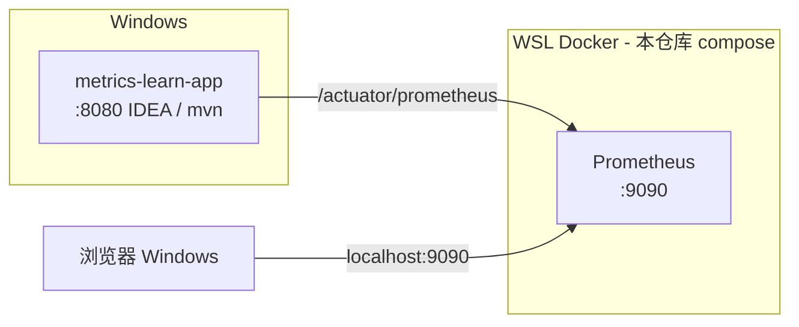

# 阶段 2：Prometheus 采集 Implementation Plan

> **For agentic workers:** REQUIRED SUB-SKILL: Use superpowers:subagent-driven-development (recommended) or superpowers:executing-plans to implement this plan task-by-task. Steps use checkbox (`- [ ]`) syntax for tracking.

**Goal:** 在 WSL Docker 中部署 Prometheus，从容器内 **Pull** Windows 本机运行的 `metrics-learn-app`（`/actuator/prometheus`），在 Prometheus UI 中确认 Target 为 **UP**，并用 PromQL 查询到 HTTP/JVM 指标。

**Architecture:** Spring Boot 应用继续在 **Windows（IDEA 或 `mvn spring-boot:run`）** 监听 `8080`；本仓库 `docker/observability/` 仅启动 **Prometheus** 单服务（Grafana 留待阶段 3）；`prometheus.yml` 通过 **WSL 默认网关 IP**（本机已验证为 `192.168.16.1:8080`）抓取 Windows 主机上的应用。若该 IP 在你环境变化，用 `ip route` 重新获取；亦可尝试 `host.docker.internal` 或备选方案 B（应用在 WSL 启动）。本阶段**不部署** Grafana。

**Tech Stack:** Prometheus 2.x（Docker）、Docker Compose、WSL2、Spring Boot Actuator、`/actuator/prometheus`、PromQL 基础

---

## 实际场景说明

### 业务故事

阶段 1 完成后，`/actuator/prometheus` 已在 Windows 本机验证通过。运维团队现在要在 **WSL Docker** 中拉起 Prometheus Server，并确认：

1. Prometheus 能否 **定期拉取** Windows 上 `metrics-learn-app` 的指标？
2. Target 状态是否为 **UP**？
3. 时序数据写入 TSDB 后，能否用 **PromQL** 查到 `http_server_requests_seconds_count`？

这是你第一次把 **应用（Windows）** 与 **监控系统（WSL 容器）** 跨环境连起来。

### 部署拓扑（本阶段目标）



### 网络路径说明（核心）

| 步骤 | 说明 |
|------|------|
| 1 | 应用在 **Windows** 绑定 `0.0.0.0:8080`（Spring Boot 默认即所有网卡） |
| 2 | Prometheus 容器在 **WSL Docker** 内运行，端口映射 `9090:9090` |
| 3 | WSL / 容器内访问 `http://192.168.16.1:8080/actuator/prometheus` 指向 **Windows 主机**（本机已验证） |
| 4 | 你在 Windows 浏览器打开 `http://localhost:9090` 查看 Prometheus UI（WSL 端口转发到 Windows） |

**推荐方案 A（本计划默认，已在本机验证）：** Windows 跑应用 + WSL Docker 跑 Prometheus + **`192.168.16.1:8080`**

`192.168.16.1` 是 WSL 中 **default 路由的网关**，在 WSL2 下通常即 Windows 主机在 WSL 网络中的地址。不同机器可能是 `172.x.x.1` 等，以 `ip route` 输出为准（见 Task 4）。

**备选方案 B：** 使用 `host.docker.internal:8080`（部分 Docker Desktop / 较新 WSL 集成环境可用；本机若 A 已通可不必切换）

**备选方案 C：** 在 WSL 内 `mvn spring-boot:run`，Prometheus target 改为 `host.docker.internal:8080` 或 `172.x.x.1:8080`（此时 Java 进程在 WSL 内）

### 阶段 2 结束时应达到的效果

| 维度 | 效果 |
|------|------|
| **Docker** | `docker compose up -d` 后 Prometheus 容器健康运行 |
| **UI** | 浏览器 `http://localhost:9090` 可打开 |
| **Target** | Status → Targets 中 job `metrics-learn` 为 **UP** |
| **PromQL** | `up{job="metrics-learn"}` 返回 `1` |
| **业务指标** | 调用 Windows 上的 API 后，能查到 `http_server_requests_seconds_count` |
| **概念** | 阅读 `docs/learning/phase-2-prometheus-scrape.md` 并完成 4 道自检题 |
| **范围边界** | 本阶段**不验收** Grafana 面板、Alertmanager |

### 当前仓库状态（增量起点）

以下**已存在**（阶段 0～1），本计划不重复实现：

| 路径 | 状态 |
|------|------|
| `metrics-learn-app` | 商品 API + `/actuator/prometheus` 可用 |
| `ActuatorPrometheusEndpointTest` | 应用侧端点测试已通过 |
| `src/test/resources/application.properties` | 测试环境启用 `management.prometheus.metrics.export.enabled=true` |
| `README.md` | 有项目骨架，待补充阶段 2 |
| `docker/observability/` | **尚不存在**，本阶段创建 |

本计划**新建**：

- `docker/observability/docker-compose.yml`（仅 Prometheus）
- `docker/observability/prometheus/prometheus.yml`
- `docker/observability/README.md`（WSL 操作与排错速查）
- `docs/learning/phase-2-prometheus-scrape.md`
- `scripts/verify-prometheus-scrape.sh`（WSL 一键连通性检查，可选但推荐）

---

## 文件结构（本阶段新增/修改）

| 文件 | 职责 |
|------|------|
| `docker/observability/docker-compose.yml` | Prometheus 服务定义、`extra_hosts`、数据卷 |
| `docker/observability/prometheus/prometheus.yml` | `scrape_configs` 指向 Windows 应用 |
| `docker/observability/README.md` | WSL 启动命令、网络排错 |
| `docs/learning/phase-2-prometheus-scrape.md` | scrape、Target、PromQL、自检题 |
| `scripts/verify-prometheus-scrape.sh` | 从 WSL 验证能否访问 Windows 应用指标端点 |
| `README.md` | 追加阶段 2 章节 |

---

## Task 1: Prometheus 配置与 Docker Compose

**Files:**
- Create: `docker/observability/prometheus/prometheus.yml`
- Create: `docker/observability/docker-compose.yml`

- [ ] **Step 1: 创建 prometheus.yml**

```yaml
global:
  scrape_interval: 15s
  evaluation_interval: 15s
  external_labels:
    monitor: metrics-learn-local

scrape_configs:
  - job_name: metrics-learn
    metrics_path: /actuator/prometheus
    scrape_interval: 15s
    scrape_timeout: 10s
    static_configs:
      - targets:
          # WSL 默认网关 = Windows 主机（本机已验证 192.168.16.1；其他环境用 ip route 获取）
          - 192.168.16.1:8080
        labels:
          env: local
          service: metrics-learn-app
```

- [ ] **Step 2: 创建 docker-compose.yml**

```yaml
name: metrics-learn-observability

services:
  prometheus:
    image: prom/prometheus:v2.55.1
    container_name: metrics-learn-prometheus
    ports:
      - "9090:9090"
    volumes:
      - ./prometheus/prometheus.yml:/etc/prometheus/prometheus.yml:ro
      - prometheus-data:/prometheus
    command:
      - --config.file=/etc/prometheus/prometheus.yml
      - --storage.tsdb.path=/prometheus
      - --web.enable-lifecycle
    extra_hosts:
      - host.docker.internal:host-gateway
    restart: unless-stopped

volumes:
  prometheus-data:
```

说明：

- 本机 scrape target 使用 **`192.168.16.1:8080`**（WSL 网关 = Windows 主机），不依赖 `host.docker.internal` 解析。
- `extra_hosts: host.docker.internal:host-gateway` 仍保留，便于日后切换 target 或阶段 3 Grafana 等场景。
- 本阶段**只**启动 Prometheus；Grafana 在阶段 3 加入同一 compose 文件。
- 若本机 `9090` 已被占用，先将 `ports` 改为 `"9091:9090"`，UI 改用 `http://localhost:9091`（全文中的 `9090` 同步替换）。
- **IP 可能变化：** 换网络/WSL 版本后 `192.168.16.1` 可能不同，部署前在 WSL 执行 `ip route show | awk '/default/ {print $3}'` 确认。

- [ ] **Step 3: 验证 compose 语法（在 WSL 中执行）**

```bash
cd /mnt/d/Project_Install/JAVA_Develop/Operations-And-Maintenance/Grafana-Prometheus-Micrometer-Learn/docker/observability
docker compose config
```

Expected: 打印合并后的 YAML，无 ERROR。

- [ ] **Step 4: Commit**

```bash
git add docker/observability/prometheus/prometheus.yml
git add docker/observability/docker-compose.yml
git commit -m "feat(phase-2): add prometheus docker compose for scrape"
```

---

## Task 2: Windows 应用启动确认

**Files:**
- Modify（可选）: `metrics-learn-app/src/main/resources/application.yml`

**背景:** Prometheus 在 WSL 容器内需要访问 Windows 上的 `8080`。Spring Boot 默认监听所有网卡；若你曾配置 `server.address=127.0.0.1`，WSL 将无法访问。

- [ ] **Step 1: 确认 application.yml 未限制仅本机回环**

确保 **没有** 以下配置（若有则删除或注释）：

```yaml
server:
  address: 127.0.0.1   # 不要这样配，WSL 无法访问
```

当前应保留：

```yaml
server:
  port: ${SERVER_PORT:8080}
```

- [ ] **Step 2: 在 Windows 启动应用**

在 IDEA 运行 `MetricsLearnApplication`，或在 **Windows PowerShell** 中：

```powershell
cd D:\Project_Install\JAVA_Develop\Operations-And-Maintenance\Grafana-Prometheus-Micrometer-Learn
mvn -pl metrics-learn-app spring-boot:run
```

- [ ] **Step 3: Windows 本机验证端点**

```powershell
curl http://localhost:8080/actuator/health
curl http://localhost:8080/actuator/prometheus | Select-String "jvm_memory_used_bytes"
```

Expected: health 返回 `UP`；第二命令有输出。

- [ ] **Step 4: 产生 HTTP 流量**

```powershell
curl http://localhost:8080/api/products/1
curl http://localhost:8080/api/products/999
```

- [ ] **Step 5: WSL 侧验证能访问 Windows 上的应用（进入 Task 3 前必做）**

在 **WSL** 中（与 Prometheus 同一网络视角）：

```bash
# 确认 Windows 主机 IP（本机通常为 192.168.16.1）
ip route show | awk '/default/ {print $3}'

curl -s -o /dev/null -w "%{http_code}\n" http://192.168.16.1:8080/actuator/prometheus
```

Expected: 输出 `200`（与你在调试中 `curl http://192.168.16.1:8080/actuator/prometheus` 的结果一致）。

若此处不通，先完成 Task 4 排错，再启动 Prometheus。

保持应用运行，进入 Task 3。

---

## Task 3: 启动 Prometheus 并验证 Target UP

**Files:**
- Create: `docker/observability/README.md`（本 Task 写入最小启动说明，Task 5 扩充）

- [ ] **Step 1: 在 WSL 启动 Prometheus**

```bash
cd /mnt/d/Project_Install/JAVA_Develop/Operations-And-Maintenance/Grafana-Prometheus-Micrometer-Learn/docker/observability
docker compose up -d
docker compose ps
```

Expected: `metrics-learn-prometheus` 状态为 `running`。

- [ ] **Step 2: 容器网络内检查能否访问 Windows 应用（Pull 前置条件）**

```bash
# 与 prometheus.yml 中 target 保持一致
docker run --rm curlimages/curl:8.10.1 \
  curl -s -o /dev/null -w "%{http_code}\n" \
  http://192.168.16.1:8080/actuator/prometheus
```

Expected: 输出 `200`。

若输出 `000` 或超时：先在 WSL 直接 `curl http://192.168.16.1:8080/actuator/prometheus` 对比；WSL 通而容器不通时，检查 Docker 网络/防火墙；均不通则 Task 4 排错。

- [ ] **Step 3: 浏览器打开 Prometheus UI**

Windows 浏览器访问：

```text
http://localhost:9090
```

进入 **Status → Targets**，找到 job **`metrics-learn`**。

Expected:

| 字段 | 值 |
|------|-----|
| State | **UP** |
| Endpoint | `http://192.168.16.1:8080/actuator/prometheus` |
| Last Scrape | 最近 15s 内 |

- [ ] **Step 4: PromQL 验证**

在 Prometheus UI → Graph 中执行：

```promql
up{job="metrics-learn"}
```

Expected: 值为 `1`。

再执行：

```promql
http_server_requests_seconds_count{application="metrics-learn"}
```

若为空，在 Windows 再调用几次 `curl http://localhost:8080/api/products/1`，等待 15～30s 后重试。

- [ ] **Step 5: 创建 docker/observability/README.md（最小版）**

```markdown
# Observability Stack（阶段 2：仅 Prometheus）

## 前置条件

- Windows 上 `metrics-learn-app` 已启动（端口 8080）
- WSL 已安装 Docker 与 Docker Compose

## 启动

```bash
cd /mnt/d/Project_Install/JAVA_Develop/Operations-And-Maintenance/Grafana-Prometheus-Micrometer-Learn/docker/observability
docker compose up -d
```

## 停止

```bash
docker compose down
```

## UI

- Prometheus: http://localhost:9090
- Targets: http://localhost:9090/targets

## 抓取目标

- Job: `metrics-learn`
- URL: `http://192.168.16.1:8080/actuator/prometheus`（WSL 网关 = Windows 主机；以 `ip route` 为准）

## WSL 连通性预检

```bash
curl -s -o /dev/null -w "%{http_code}\n" http://192.168.16.1:8080/actuator/prometheus
# 期望 200
```
```

- [ ] **Step 6: Commit**

```bash
git add docker/observability/README.md
git commit -m "docs(phase-2): add observability stack quick start"
```

---

## Task 4: Windows ↔ WSL 网络排错

**Files:**
- Modify: `docker/observability/prometheus/prometheus.yml`（IP 变化时）
- Modify: `docker/observability/README.md`（追加排错章节）

### 本机已验证路径

```bash
# WSL → Windows 上的 IDEA 应用（本机成功）
ping -c 2 192.168.16.1
curl -s http://192.168.16.1:8080/actuator/prometheus | head -5
```

`prometheus.yml` 的 target 应与上述 **同一 IP:端口**。

### 排错决策树

```text
WSL curl 192.168.16.1:8080 失败？
├─ 步骤 1：重新获取 WIN_HOST（ip route），更新 prometheus.yml
├─ 步骤 2：Windows 防火墙放行 8080
├─ 步骤 3：检查 server.address 是否绑死 127.0.0.1
├─ 步骤 4：尝试 host.docker.internal:8080（改 target + extra_hosts）
└─ 步骤 5：备选 — 应用在 WSL 内 spring-boot:run
```

- [ ] **Step 1: 重新确认 Windows 主机 IP**

在 **WSL** 中：

```bash
WIN_HOST=$(ip route show | awk '/default/ {print $3}')
echo "Windows host IP from WSL: $WIN_HOST"
curl -s -o /dev/null -w "%{http_code}\n" "http://$WIN_HOST:8080/actuator/prometheus"
```

Expected: 本机 `$WIN_HOST` 为 `192.168.16.1`，HTTP 码 `200`。

若 IP 不是 `192.168.16.1`，修改 `prometheus.yml`：

```yaml
    static_configs:
      - targets:
          - 192.168.x.x:8080    # 替换为 echo 得到的 WIN_HOST
```

然后：

```bash
cd /mnt/d/Project_Install/JAVA_Develop/Operations-And-Maintenance/Grafana-Prometheus-Micrometer-Learn/docker/observability
docker compose restart prometheus
```

- [ ] **Step 2: Windows 防火墙（WSL 仍无法 curl 时）**

在 **Windows PowerShell（管理员）** 中：

```powershell
New-NetFirewallRule -DisplayName "metrics-learn-app 8080" -Direction Inbound -Action Allow -Protocol TCP -LocalPort 8080
```

然后在 WSL 重复 Step 1 的 curl 测试。

- [ ] **Step 3: 尝试 host.docker.internal（可选 fallback）**

将 `prometheus.yml` target 改为 `host.docker.internal:8080`，并确保 compose 含 `extra_hosts: host.docker.internal:host-gateway`。

容器内验证：

```bash
docker run --rm curlimages/curl:8.10.1 \
  curl -s -o /dev/null -w "%{http_code}\n" \
  http://host.docker.internal:8080/actuator/prometheus
```

- [ ] **Step 4: 备选 — 应用在 WSL 启动**

在 WSL 中（确保 JDK 21、Maven 可用）：

```bash
cd /mnt/d/Project_Install/JAVA_Develop/Operations-And-Maintenance/Grafana-Prometheus-Micrometer-Learn
mvn -pl metrics-learn-app spring-boot:run
```

target 可用 `host.docker.internal:8080` 或 WSL 的 `WIN_HOST:8080`。

验证：

```bash
curl http://localhost:8080/actuator/prometheus | head -5
```

- [ ] **Step 5: 将排错内容追加到 docker/observability/README.md**

在 README 末尾追加章节 **「Windows 应用 + WSL Prometheus 排错」**，包含：本机 `192.168.16.1` 示例、`ip route` 获取 IP、防火墙、host.docker.internal fallback。

- [ ] **Step 6: Commit（若有配置变更）**

```bash
git add docker/observability/prometheus/prometheus.yml docker/observability/README.md
git commit -m "docs(phase-2): add windows-wsl network troubleshooting"
```

---

## Task 5: 连通性验证脚本

**Files:**
- Create: `scripts/verify-prometheus-scrape.sh`

- [ ] **Step 1: 创建验证脚本**

```bash
#!/usr/bin/env bash
set -euo pipefail

# 默认与 prometheus.yml 一致；本机已验证 Windows 主机为 192.168.16.1
APP_URL="${APP_URL:-http://192.168.16.1:8080/actuator/prometheus}"
PROM_URL="${PROM_URL:-http://localhost:9090}"

echo "==> 1. Check app prometheus endpoint from docker network"
HTTP_CODE=$(docker run --rm curlimages/curl:8.10.1 \
  curl -s -o /dev/null -w "%{http_code}" "$APP_URL")
echo "App endpoint HTTP code: $HTTP_CODE"
if [[ "$HTTP_CODE" != "200" ]]; then
  echo "FAIL: Cannot reach $APP_URL from container."
  echo "Hint: see docker/observability/README.md troubleshooting"
  exit 1
fi

echo "==> 2. Check Prometheus ready"
curl -sf "$PROM_URL/-/ready" > /dev/null
echo "Prometheus is ready."

echo "==> 3. Check target UP via PromQL"
RESULT=$(curl -sf "$PROM_URL/api/v1/query" --data-urlencode 'query=up{job="metrics-learn"}')
echo "$RESULT" | grep -q '"value":\[.*,"1"\]' && echo "Target metrics-learn is UP." || {
  echo "FAIL: Target not UP. Open $PROM_URL/targets"
  echo "$RESULT"
  exit 1
}

echo "ALL CHECKS PASSED"
```

- [ ] **Step 2: 赋予执行权限并在 WSL 运行**

```bash
chmod +x /mnt/d/Project_Install/JAVA_Develop/Operations-And-Maintenance/Grafana-Prometheus-Micrometer-Learn/scripts/verify-prometheus-scrape.sh
/mnt/d/Project_Install/JAVA_Develop/Operations-And-Maintenance/Grafana-Prometheus-Micrometer-Learn/scripts/verify-prometheus-scrape.sh
```

Expected: 输出 `ALL CHECKS PASSED`。

- [ ] **Step 3: Commit**

```bash
git add scripts/verify-prometheus-scrape.sh
git commit -m "chore(phase-2): add prometheus scrape verification script"
```

---

## Task 6: 概念学习文档

**Files:**
- Create: `docs/learning/phase-2-prometheus-scrape.md`

- [ ] **Step 1: 创建完整概念文档**

```markdown
# 阶段 2：Prometheus 采集

## 1. 本阶段在链路中的位置

```text
metrics-learn-app（Windows :8080）
    → /actuator/prometheus
    → Prometheus（WSL Docker :9090）定期 Pull
    → TSDB 存储
    → [阶段 3] Grafana 查询
```

阶段 1 是「应用暴露指标」；阶段 2 是「监控系统拉取并存储」。

## 2. Pull 模型回顾

| 角色 | 行为 |
|------|------|
| 应用 | 被动暴露 HTTP 端点，不主动推送 |
| Prometheus | 按 `scrape_interval` 主动 HTTP GET |
| 你的环境 | WSL/容器访问 `192.168.16.1:8080`（WSL 网关）到达 Windows 上的应用 |

## 3. prometheus.yml 核心概念

| 字段 | 含义 |
|------|------|
| `job_name` | 逻辑分组名，成为标签 `job` |
| `metrics_path` | 抓取路径，Spring Boot 为 `/actuator/prometheus` |
| `static_configs.targets` | 静态目标列表（A 阶段常用） |
| `scrape_interval` | 拉取间隔（本配置 15s） |
| `labels` | 额外静态标签（如 `env=local`） |

## 4. Target UP / DOWN

| 状态 | 含义 |
|------|------|
| UP | 上次 scrape 成功（HTTP 200 且格式可解析） |
| DOWN | 连接失败、超时、非 200、应用未启动 |

**注意：** Target UP 只说明「Prometheus 能抓到数据」，不等于业务无错误。

## 5. 时序数据模型

一条时间序列由 **指标名 + 标签集** 唯一确定：

```text
http_server_requests_seconds_count{application="metrics-learn",job="metrics-learn",method="GET",...}
```

同一指标名，标签不同 = 不同时间序列。

## 6. PromQL 入门（本阶段必会）

| 查询 | 作用 |
|------|------|
| `up{job="metrics-learn"}` | 目标是否存活（1=UP） |
| `http_server_requests_seconds_count` | 查看 HTTP 请求计数样本 |
| `http_server_requests_seconds_count{status="404"}` | 按标签过滤 |
| `count(http_server_requests_seconds_count)` | 时间序列条数（感受标签维度） |

在 Graph 页面执行后，切换到 **Table** 视图查看标签更清晰。

## 7. Windows + WSL 网络要点

| 概念 | 说明 |
|------|------|
| `192.168.16.1` | 本机 WSL **default 网关**，即 Windows 主机在 WSL 中的地址（已验证可 curl 指标端点） |
| 与 `localhost` 区别 | Windows 上 `localhost:8080` 通，不代表 WSL 能访问；需在 WSL 用网关 IP 单独测 |
| IP 是否会变 | 换网络/重装 WSL 后可能变化，用 `ip route \| awk '/default/ {print $3}'` 重查 |

| 现象 | 常见原因 |
|------|----------|
| WSL `curl 192.168.16.1:8080` 超时 | Windows 防火墙拦截 8080，或应用只监听 127.0.0.1 |
| WSL 通、Prometheus Target DOWN | `prometheus.yml` target IP 与实测不一致，或容器网络特殊限制 |
| `host.docker.internal` 不通但 IP 通 | 正常；本计划优先用 **网关 IP** 作 target |

推荐日常开发：**Windows 跑 IDEA，WSL 跑 Prometheus**，`prometheus.yml` 写 **`192.168.16.1:8080`**（或你 `ip route` 得到的网关）。

## 8. 动手练习

1. 在 Prometheus UI 打开 `/targets`，截图或记录 `metrics-learn` 的 State。
2. 执行 `up{job="metrics-learn"}`，记录返回值。
3. 调用 5 次 `GET /api/products/1`，等待 30s，查询 `http_server_requests_seconds_count` 是否增长。
4. 故意停止 Windows 应用，观察 Target 变为 **DOWN** 的时间（约 1 个 scrape 周期后）。

## 9. 自检题

1. `scrape_configs` 中 `job_name` 和 `targets` 分别解决什么问题？
2. 为什么应用不需要知道 Prometheus 的地址（Pull vs Push）？
3. Target 显示 UP 时，是否一定能在 PromQL 中查到 `http_server_requests_seconds_count`？为什么？
4. 为什么 Prometheus 要用 `192.168.16.1` 而不是 `localhost`？如何确认该 IP？

## 10. 参考答案要点

1. `job_name` 给目标打 `job` 标签便于分组；`targets` 是抓取地址 host:port。
2. Pull 模式下 Prometheus 来应用拉数据；应用只暴露端点。
3. 不一定；若无 HTTP 流量，计数器可能尚未出现或值为 0，但 `up` 仍为 1。
4. Prometheus 跑在 WSL/容器内，`localhost` 指向容器自身而非 Windows；`192.168.16.1` 是 WSL 到 Windows 的网关。用 `ip route` 获取并 `curl http://<网关>:8080/actuator/prometheus` 验证。

## 11. 下一阶段预告

阶段 3 将在同一 `docker/observability` 中加入 Grafana，配置 Prometheus 数据源并创建 HTTP/JVM 面板。
```

- [ ] **Step 2: Commit**

```bash
git add docs/learning/phase-2-prometheus-scrape.md
git commit -m "docs(phase-2): add prometheus scrape concepts"
```

---

## Task 7: README 阶段导航更新

**Files:**
- Modify: `README.md`

- [ ] **Step 1: 在 README.md 追加阶段 2 章节**

```markdown
## 阶段 2：Prometheus 采集

### 场景

Windows 运行 `metrics-learn-app`，WSL Docker 运行 Prometheus，验证跨环境 Pull 采集。

### 启动顺序

1. **Windows**：启动应用（IDEA 或 `mvn -pl metrics-learn-app spring-boot:run`）
2. **WSL**：

```bash
cd /mnt/d/Project_Install/JAVA_Develop/Operations-And-Maintenance/Grafana-Prometheus-Micrometer-Learn/docker/observability
docker compose up -d
```

### 验证

```bash
# WSL：先确认能访问 Windows 上的应用（本机网关 192.168.16.1）
curl -s -o /dev/null -w "%{http_code}\n" http://192.168.16.1:8080/actuator/prometheus

# WSL：容器网络（与 prometheus.yml target 一致）
docker run --rm curlimages/curl:8.10.1 curl -s -o /dev/null -w "%{http_code}\n" http://192.168.16.1:8080/actuator/prometheus

# WSL：一键检查（应用与 Prometheus 均需已启动）
./scripts/verify-prometheus-scrape.sh
```

- Prometheus UI: http://localhost:9090
- Targets: http://localhost:9090/targets （job `metrics-learn` 应为 UP）

### PromQL 练习

```promql
up{job="metrics-learn"}
http_server_requests_seconds_count{application="metrics-learn"}
```

### 概念学习

[docs/learning/phase-2-prometheus-scrape.md](docs/learning/phase-2-prometheus-scrape.md)

### 网络排错

见 [docker/observability/README.md](docker/observability/README.md)

### 阶段 2 验收 Checklist

- [ ] Windows 应用 `/actuator/prometheus` 返回 200
- [ ] `docker compose up -d` 后 Prometheus 容器运行
- [ ] WSL `curl http://192.168.16.1:8080/actuator/prometheus` 返回 200
- [ ] 容器内 curl 同一地址返回 200
- [ ] Targets 页面 job `metrics-learn` 为 UP
- [ ] `up{job="metrics-learn"}` 为 1
- [ ] 能查到 `http_server_requests_seconds_count`
- [ ] 完成概念文档 4 道自检题

### 下一步

阶段 3：在同一 compose 中加入 Grafana 与可视化面板。
```

- [ ] **Step 2: Commit**

```bash
git add README.md
git commit -m "docs(phase-2): add README section for prometheus scrape"
```

---

## Task 8: 手动验收（端到端）

**Files:** 无

- [ ] **Step 1: 完整启动顺序演练**

| 顺序 | 环境 | 操作 |
|------|------|------|
| 1 | Windows | 启动 `metrics-learn-app` |
| 2 | Windows | `curl http://localhost:8080/api/products/1` × 3 |
| 3 | WSL | `docker compose up -d` |
| 4 | WSL | 运行 `scripts/verify-prometheus-scrape.sh` |
| 5 | Windows 浏览器 | 打开 `http://localhost:9090/targets` 确认 UP |

- [ ] **Step 2: 停止应用观察 DOWN**

停止 Windows 上的 Spring Boot，等待 30s，刷新 Targets 页面。

Expected: `metrics-learn` 变为 **DOWN**；理解告警基础（阶段 5 前先看现象即可）。

- [ ] **Step 3: 重启应用观察恢复**

重新启动应用，等待 15～30s。

Expected: Target 恢复 **UP**。

- [ ] **Step 4: 在 README 阶段 2 Checklist 打勾**

---

## Spec 覆盖自检

| 设计文档阶段 2 要求 | 对应 Task |
|--------------------|-----------|
| `docker compose up` 启动 Prometheus | Task 1、3 |
| `prometheus.yml` scrape 配置 | Task 1 |
| 指向 Windows 主机（本机 `192.168.16.1:8080`） | Task 1、Task 4（含 fallback） |
| Targets 页面 UP | Task 3、8 |
| `up{job="metrics-learn"}` | Task 3、6 |
| 查到 `http_server_requests_seconds_count` | Task 3、8 |
| Windows 开发 + WSL Docker | 全文架构 + Task 4 排错 |

**范围外（刻意不做）：** Grafana、Alertmanager、服务发现、Pushgateway。

**占位符扫描：** 无 TBD / TODO / 省略实现。

---

## 预估耗时

| Task | 时间 |
|------|------|
| Task 1 Compose 配置 | 20～30 分钟 |
| Task 2 Windows 应用确认 | 10 分钟 |
| Task 3 启动与 Target 验证 | 20～30 分钟 |
| Task 4 网络排错（若顺利可跳过） | 0～40 分钟 |
| Task 5 验证脚本 | 15 分钟 |
| Task 6～7 文档 | 30～40 分钟 |
| Task 8 手动验收 | 15～20 分钟 |
| **合计** | **约 2～3 小时**（含排错） |

---

*Plan version: 1.1 · 2026-06-26 · 默认 scrape target 更新为本机已验证的 192.168.16.1:8080*
