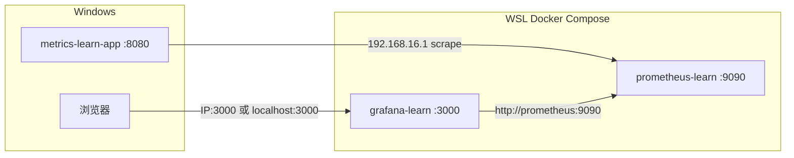

# 阶段 3：Grafana 可视化 Implementation Plan

> **For agentic workers:** REQUIRED SUB-SKILL: Use superpowers:subagent-driven-development (recommended) or superpowers:executing-plans to implement this plan task-by-task. Steps use checkbox (`- [ ]`) syntax for tracking.

**Goal:** 在已有 Prometheus 采集链路上增加 Grafana，自动配置 Prometheus 数据源，并提供包含 HTTP QPS、P95 延迟、JVM 堆内存、GC 四个 Panel 的学习仪表盘，掌握在 Grafana 中查看 Micrometer 指标与常用 PromQL 函数。

**Architecture:** 延续阶段 2 拓扑——**Windows** 运行 `metrics-learn-app`，**WSL Docker Compose** 运行 `prometheus-learn` + 新增 `grafana-learn`；Grafana 通过 Compose 内网 `http://prometheus:9090` 查询数据；使用 **provisioning** 自动注册数据源与 Dashboard；数据目录 `./grafana-data` 与 compose 同级 bind mount。本阶段**不**做告警规则、Alertmanager、业务自定义指标（阶段 4）。

**Tech Stack:** Grafana 11.x（Docker）、Prometheus（已有）、Docker Compose、PromQL（`rate`、`histogram_quantile`、`sum by`）、Grafana Provisioning（YAML + JSON Dashboard）

---

## 实际场景说明

### 业务故事

阶段 2 完成后，Prometheus 已能 Pull Windows 上 `metrics-learn-app` 的指标，你也已在 Prometheus UI 中用 PromQL 查到数据。团队下一步要求：

1. 用 **Grafana** 把指标画成可读的图表（比 Prometheus Graph 更适合日常查看）
2. 值班同学打开一个 Dashboard 就能看到：**QPS、延迟、JVM 内存、GC**
3. 调用商品 API 后，曲线应 **明显变化**

### 部署拓扑（本阶段目标）



### 访问地址说明

| 服务 | 典型 URL | 说明 |
|------|----------|------|
| Grafana | `http://localhost:3000` | WSL 端口转发到 Windows 时 |
| Grafana | `http://192.168.x.x:3000` | 与阶段 2 访问 Prometheus 同一 WSL 主机 IP |
| Prometheus | `http://localhost:9090` | 阶段 2 已有，本阶段仍用于对照排错 |

默认登录（学习用，**勿用于生产**）：

- 用户名：`admin`
- 密码：`metrics-learn`

### 阶段 3 结束时应达到的效果

| 维度 | 效果 |
|------|------|
| **Docker** | `docker compose up -d` 后 `prometheus-learn` + `grafana-learn` 均为 healthy |
| **数据源** | Grafana 中 Prometheus 数据源 **绿色**（Save & test 成功） |
| **Dashboard** | 打开 **Metrics Learn Overview**，可见 4 个 Panel |
| **Panel 1** | HTTP 请求速率（QPS），PromQL 含 `rate(...[1m])` |
| **Panel 2** | HTTP P95 延迟，PromQL 含 `histogram_quantile(0.95, ...)` |
| **Panel 3** | JVM 堆内存使用量 |
| **Panel 4** | GC 暂停次数/速率 |
| **联动** | 多次 `curl /api/products/1` 后 QPS 曲线上升 |
| **概念** | 阅读 `docs/learning/phase-3-grafana-visualization.md` 并完成 4 道自检题 |
| **范围边界** | 不做 Alertmanager、不做 Redis/Postgres/业务 Counter（阶段 4） |

### 当前仓库状态（增量起点 — 阶段 2 已完成）

以下**已存在**，本计划不重复实现：

| 路径 | 状态 |
|------|------|
| `docker/observability/docker-compose.yml` | 含 `prometheus-learn`、健康检查、`./prometheus-data` bind mount |
| `docker/observability/prometheus/prometheus.yml` | target `192.168.16.1:8080`，job `metrics-learn` |
| `metrics-learn-app` | 商品 API + `/actuator/prometheus` |
| 阶段 0～1 测试与 Actuator 配置 | 可用 |

本计划**新建/修改**：

- `docker/observability/docker-compose.yml` — 追加 `grafana-learn`
- `docker/observability/grafana/provisioning/datasources/prometheus.yml`
- `docker/observability/grafana/provisioning/dashboards/default.yml`
- `docker/observability/grafana/dashboards/metrics-learn-overview.json`
- `docker/observability/README.md` — 追加 Grafana 章节
- `docs/learning/phase-3-grafana-visualization.md`
- `scripts/verify-grafana.sh`
- `README.md` — 阶段 3 章节
- `.gitignore` — 忽略 `grafana-data/`

---

## 文件结构（本阶段新增/修改）

| 文件 | 职责 |
|------|------|
| `docker/observability/docker-compose.yml` | 新增 Grafana 服务、依赖 Prometheus healthy |
| `docker/observability/grafana/provisioning/datasources/prometheus.yml` | 自动注册 Prometheus 数据源 |
| `docker/observability/grafana/provisioning/dashboards/default.yml` | 自动加载 JSON Dashboard |
| `docker/observability/grafana/dashboards/metrics-learn-overview.json` | 4 Panel 学习仪表盘 |
| `docker/observability/README.md` | 启动顺序、登录、排错 |
| `docs/learning/phase-3-grafana-visualization.md` | 概念、UI 导览、PromQL、自检题 |
| `scripts/verify-grafana.sh` | 检查 Grafana health + 数据源 |
| `.gitignore` | `docker/observability/grafana-data/` |

---

## Task 1: 扩展 docker-compose，添加 Grafana 服务

**Files:**
- Modify: `docker/observability/docker-compose.yml`
- Modify: `.gitignore`

- [ ] **Step 1: 在 .gitignore 追加 Grafana 数据目录**

在 `# Docker / Observability stack runtime data` 小节追加：

```gitignore
docker/observability/grafana-data/
```

- [ ] **Step 2: 更新 docker-compose.yml（完整文件）**

```yaml
name: metrics-learn-observability

services:
  prometheus:
    image: prom/prometheus:v2.55.1
    container_name: prometheus-learn
    ports:
      - "9090:9090"
    volumes:
      - ./prometheus/prometheus.yml:/etc/prometheus/prometheus.yml:ro
      - ./prometheus-data:/prometheus
    command:
      - --config.file=/etc/prometheus/prometheus.yml
      - --storage.tsdb.path=/prometheus
      - --web.enable-lifecycle
    extra_hosts:
      - host.docker.internal:host-gateway
    healthcheck:
      test: ["CMD", "wget", "--no-verbose", "--tries=1", "--spider", "http://localhost:9090/-/healthy"]
      interval: 30s
      timeout: 5s
      retries: 3
      start_period: 40s
    restart: unless-stopped

  grafana:
    image: grafana/grafana:11.3.0
    container_name: grafana-learn
    ports:
      - "3000:3000"
    volumes:
      - ./grafana/provisioning:/etc/grafana/provisioning:ro
      - ./grafana/dashboards:/var/lib/grafana/dashboards:ro
      - ./grafana-data:/var/lib/grafana
    environment:
      GF_SECURITY_ADMIN_USER: admin
      GF_SECURITY_ADMIN_PASSWORD: metrics-learn
      GF_USERS_ALLOW_SIGN_UP: "false"
      GF_SERVER_ROOT_URL: http://localhost:3000
    depends_on:
      prometheus:
        condition: service_healthy
    healthcheck:
      test: ["CMD", "wget", "--no-verbose", "--tries=1", "--spider", "http://localhost:3000/api/health"]
      interval: 30s
      timeout: 5s
      retries: 3
      start_period: 40s
    restart: unless-stopped
```

- [ ] **Step 3: 创建 grafana-data 目录并设置权限（WSL）**

```bash
cd /work/Metrics   # 或你的 compose 所在目录
mkdir -p grafana-data
sudo chown -R 472:472 grafana-data
```

说明：Grafana 容器内默认用户 UID 为 **472**。

- [ ] **Step 4: 验证 compose 语法**

```bash
docker compose config
```

Expected: 无 ERROR，可见 `grafana` 与 `prometheus` 两个 service。

- [ ] **Step 5: Commit**

```bash
git add docker/observability/docker-compose.yml .gitignore
git commit -m "feat(phase-3): add grafana-learn service to observability stack"
```

---

## Task 2: Grafana 数据源 Provisioning

**Files:**
- Create: `docker/observability/grafana/provisioning/datasources/prometheus.yml`

- [ ] **Step 1: 创建数据源配置**

```yaml
apiVersion: 1

datasources:
  - name: Prometheus
    type: prometheus
    uid: prometheus
    access: proxy
    url: http://prometheus:9090
    isDefault: true
    editable: true
    jsonData:
      timeInterval: 15s
      httpMethod: POST
```

说明：

- **`url: http://prometheus:9090`**：使用 Compose **服务名** `prometheus`，不是 `localhost`（Grafana 在容器内，`localhost` 指向自身）。
- **`access: proxy`**：Grafana 后端代发查询（Grafana Server 模式，学习项目标准做法）。
- **`uid: prometheus`**：Dashboard JSON 引用数据源时使用。

- [ ] **Step 2: Commit**

```bash
git add docker/observability/grafana/provisioning/datasources/prometheus.yml
git commit -m "feat(phase-3): provision grafana prometheus datasource"
```

---

## Task 3: Dashboard Provisioning（4 Panel 学习仪表盘）

**Files:**
- Create: `docker/observability/grafana/provisioning/dashboards/default.yml`
- Create: `docker/observability/grafana/dashboards/metrics-learn-overview.json`

- [ ] **Step 1: 创建 dashboard provider 配置**

```yaml
apiVersion: 1

providers:
  - name: metrics-learn
    orgId: 1
    folder: Metrics Learn
    type: file
    disableDeletion: false
    updateIntervalSeconds: 30
    allowUiUpdates: true
    options:
      path: /var/lib/grafana/dashboards
      foldersFromFilesStructure: false
```

- [ ] **Step 2: 创建 metrics-learn-overview.json**

将以下完整 JSON 写入文件（4 个 Panel，UID 与数据源 `prometheus` 对齐）：

```json
{
  "uid": "metrics-learn-overview",
  "title": "Metrics Learn Overview",
  "tags": ["metrics-learn", "phase-3"],
  "timezone": "browser",
  "schemaVersion": 39,
  "version": 1,
  "refresh": "10s",
  "time": {
    "from": "now-15m",
    "to": "now"
  },
  "panels": [
    {
      "id": 1,
      "title": "HTTP Request Rate (QPS)",
      "description": "sum(rate(http_server_requests_seconds_count[1m]))",
      "type": "timeseries",
      "gridPos": { "h": 8, "w": 12, "x": 0, "y": 0 },
      "datasource": { "type": "prometheus", "uid": "prometheus" },
      "fieldConfig": {
        "defaults": {
          "unit": "reqps",
          "custom": { "drawStyle": "line", "lineWidth": 1, "fillOpacity": 10 }
        },
        "overrides": []
      },
      "targets": [
        {
          "refId": "A",
          "expr": "sum(rate(http_server_requests_seconds_count{application=\"metrics-learn\"}[1m]))",
          "legendFormat": "total QPS"
        }
      ]
    },
    {
      "id": 2,
      "title": "HTTP Latency P95",
      "description": "histogram_quantile(0.95, sum(rate(..._bucket[5m])) by (le))",
      "type": "timeseries",
      "gridPos": { "h": 8, "w": 12, "x": 12, "y": 0 },
      "datasource": { "type": "prometheus", "uid": "prometheus" },
      "fieldConfig": {
        "defaults": {
          "unit": "s",
          "custom": { "drawStyle": "line", "lineWidth": 1, "fillOpacity": 10 }
        },
        "overrides": []
      },
      "targets": [
        {
          "refId": "A",
          "expr": "histogram_quantile(0.95, sum(rate(http_server_requests_seconds_bucket{application=\"metrics-learn\"}[5m])) by (le))",
          "legendFormat": "P95"
        }
      ]
    },
    {
      "id": 3,
      "title": "JVM Heap Used",
      "description": "jvm_memory_used_bytes{area=\"heap\"}",
      "type": "timeseries",
      "gridPos": { "h": 8, "w": 12, "x": 0, "y": 8 },
      "datasource": { "type": "prometheus", "uid": "prometheus" },
      "fieldConfig": {
        "defaults": {
          "unit": "bytes",
          "custom": { "drawStyle": "line", "lineWidth": 1, "fillOpacity": 10 }
        },
        "overrides": []
      },
      "targets": [
        {
          "refId": "A",
          "expr": "sum(jvm_memory_used_bytes{application=\"metrics-learn\", area=\"heap\"})",
          "legendFormat": "heap used"
        }
      ]
    },
    {
      "id": 4,
      "title": "GC Pause Rate",
      "description": "rate(jvm_gc_pause_seconds_count[1m])",
      "type": "timeseries",
      "gridPos": { "h": 8, "w": 12, "x": 12, "y": 8 },
      "datasource": { "type": "prometheus", "uid": "prometheus" },
      "fieldConfig": {
        "defaults": {
          "unit": "ops",
          "custom": { "drawStyle": "line", "lineWidth": 1, "fillOpacity": 10 }
        },
        "overrides": []
      },
      "targets": [
        {
          "refId": "A",
          "expr": "sum(rate(jvm_gc_pause_seconds_count{application=\"metrics-learn\"}[1m]))",
          "legendFormat": "GC pauses/s"
        }
      ]
    }
  ]
}
```

- [ ] **Step 3: Commit**

```bash
git add docker/observability/grafana/provisioning/dashboards/default.yml
git add docker/observability/grafana/dashboards/metrics-learn-overview.json
git commit -m "feat(phase-3): add metrics-learn grafana dashboard with 4 panels"
```

---

## Task 4: 启动全栈并验证 Grafana

**Files:**
- Modify: `docker/observability/README.md`（追加 Grafana 章节）

- [ ] **Step 1: 启动前检查清单**

| 检查项 | 命令/操作 |
|--------|-----------|
| Windows 应用运行中 | IDEA 或 `mvn -pl metrics-learn-app spring-boot:run` |
| Prometheus Target UP | 浏览器 `http://<IP>:9090/targets` |
| 目录权限 | `grafana-data` 归属 UID 472 |

- [ ] **Step 2: 在 WSL 启动/重建栈**

```bash
cd /work/Metrics/docker/observability   # 按你的实际路径
docker compose up -d
docker compose ps
```

Expected:

| 容器 | STATUS |
|------|--------|
| `prometheus-learn` | Up (healthy) |
| `grafana-learn` | Up (healthy) |

- [ ] **Step 3: 浏览器登录 Grafana**

访问 `http://localhost:3000` 或 `http://192.168.x.x:3000`（与 Prometheus 同主机 IP）。

- 用户名：`admin`
- 密码：`metrics-learn`

首次登录若提示改密码，学习阶段可 **Skip** 或改为易记密码。

- [ ] **Step 4: 验证数据源**

路径：**Connections → Data sources → Prometheus → Save & test**

Expected: 绿色提示 **Successfully queried the Prometheus API.**

- [ ] **Step 5: 打开 Dashboard**

路径：**Dashboards → Metrics Learn → Metrics Learn Overview**

Expected: 4 个 Panel 可见（可能暂时较平，因流量少）。

- [ ] **Step 6: 产生流量并观察曲线**

Windows PowerShell：

```powershell
1..20 | ForEach-Object { curl -s http://localhost:8080/api/products/1 | Out-Null; Start-Sleep -Milliseconds 200 }
```

回到 Grafana Dashboard，右上角确认 **Refresh: 10s**，时间范围 **Last 15 minutes**。

Expected: **HTTP Request Rate (QPS)** Panel 曲线明显抬升。

- [ ] **Step 7: 更新 docker/observability/README.md**

在现有 README 末尾追加：

```markdown
## Grafana（阶段 3）

- URL: http://localhost:3000
- 默认账号: admin / metrics-learn
- Dashboard: Metrics Learn → Metrics Learn Overview
- 数据源: Prometheus → http://prometheus:9090（容器内网，自动 provisioning）

### 启动全栈

```bash
docker compose up -d
```

### 无数据排错

1. Prometheus Targets 是否 UP
2. Grafana 数据源 Save & test 是否成功
3. Dashboard 时间范围是否包含最近操作（Last 15 minutes）
4. Windows 应用是否在产生 HTTP 流量
```

- [ ] **Step 8: Commit**

```bash
git add docker/observability/README.md
git commit -m "docs(phase-3): add grafana usage to observability readme"
```

---

## Task 5: Grafana 验证脚本

**Files:**
- Create: `scripts/verify-grafana.sh`

- [ ] **Step 1: 创建脚本**

```bash
#!/usr/bin/env bash
set -euo pipefail

GRAFANA_URL="${GRAFANA_URL:-http://localhost:3000}"
GRAFANA_USER="${GRAFANA_USER:-admin}"
GRAFANA_PASSWORD="${GRAFANA_PASSWORD:-metrics-learn}"

echo "==> 1. Check Grafana health"
curl -sf "${GRAFANA_URL}/api/health" | grep -q '"database":"ok"' && echo "Grafana health OK."

echo "==> 2. Check Prometheus datasource"
AUTH="${GRAFANA_USER}:${GRAFANA_PASSWORD}"
DATASOURCES=$(curl -sf -u "$AUTH" "${GRAFANA_URL}/api/datasources")
echo "$DATASOURCES" | grep -q '"type":"prometheus"' && echo "Prometheus datasource found."

echo "==> 3. Test datasource query (up metric)"
curl -sf -u "$AUTH" \
  -H "Content-Type: application/json" \
  -d '{"queries":[{"refId":"A","expr":"up{job=\"metrics-learn\"}","instant":true,"datasource":{"type":"prometheus","uid":"prometheus"}}],"from":"now-5m","to":"now"}' \
  "${GRAFANA_URL}/api/ds/query" > /dev/null
echo "Datasource query OK."

echo "ALL CHECKS PASSED"
```

- [ ] **Step 2: 运行脚本（WSL，Grafana 已启动）**

```bash
chmod +x scripts/verify-grafana.sh
./scripts/verify-grafana.sh
```

Expected: `ALL CHECKS PASSED`

- [ ] **Step 3: Commit**

```bash
git add scripts/verify-grafana.sh
git commit -m "chore(phase-3): add grafana verification script"
```

---

## Task 6: 概念学习文档

**Files:**
- Create: `docs/learning/phase-3-grafana-visualization.md`

- [ ] **Step 1: 创建完整概念文档**

```markdown
# 阶段 3：Grafana 可视化

## 1. 本阶段在链路中的位置

```text
metrics-learn-app → /actuator/prometheus
    → Prometheus TSDB（阶段 2）
    → Grafana Dashboard（阶段 3，PromQL 查询 + 图表）
```

Prometheus 负责 **存储与查询引擎**；Grafana 负责 **展示与交互**。

## 2. Grafana 核心概念

| 概念 | 说明 |
|------|------|
| **Data Source** | 指标来源，本项为 Prometheus |
| **Dashboard** | 一页多个 Panel 的集合 |
| **Panel** | 单个图表/Stat/Table |
| **Query** | Panel 内的 PromQL 表达式 |
| **Time range** | 右上角时间范围（如 Last 15 minutes） |
| **Refresh** | 自动刷新间隔（本 Dashboard 为 10s） |

## 3. Prometheus UI vs Grafana

| 对比 | Prometheus Graph | Grafana |
|------|------------------|---------|
| 主要用途 | 排错、验证 PromQL | 日常监控、仪表盘 |
| 配置持久化 | 无 Dashboard 概念 | JSON / provisioning 可版本化 |
| 数据源 | 仅自身 TSDB | 可接多种（本阶段仅 Prometheus） |

阶段 2 用 Prometheus 确认 **有数据**；阶段 3 用 Grafana 确认 **看得清**。

## 4. 四个 Panel 的 PromQL 解读

### Panel 1 — HTTP QPS

```promql
sum(rate(http_server_requests_seconds_count{application="metrics-learn"}[1m]))
```

- `rate(...[1m])`：每秒增长率（Counter 必用 rate）
- `sum(...)`：汇总所有 label 组合的总 QPS

### Panel 2 — HTTP P95 延迟

```promql
histogram_quantile(0.95, sum(rate(http_server_requests_seconds_bucket{application="metrics-learn"}[5m])) by (le))
```

- `_bucket` + `le`：直方图分位数计算
- `0.95`：95 分位延迟

### Panel 3 — JVM 堆内存

```promql
sum(jvm_memory_used_bytes{application="metrics-learn", area="heap"})
```

Gauge 类型，直接看当前堆使用量。

### Panel 4 — GC 速率

```promql
sum(rate(jvm_gc_pause_seconds_count{application="metrics-learn"}[1m]))
```

GC 暂停次数的增长率（次/秒）。

## 5. Grafana UI 操作指引（你该点哪里）

| 目标 | 路径 |
|------|------|
| 看数据源是否正常 | Connections → Data sources → Prometheus |
| 打开学习 Dashboard | Dashboards → Metrics Learn → Metrics Learn Overview |
| 编辑 Panel 查询 | Dashboard 右上角 ⋮ → Edit → 点击 Panel → Query |
| 改时间范围 | 右上角 Last 15 minutes |
| 手动刷新 | 右上角 Refresh 按钮 |

**不必纠结** Explore 高级选项、Alerting 规则（后续阶段再学）。

## 6. Provisioning 是什么？

本仓库通过文件自动配置，避免每次手工点 UI：

| 文件 | 作用 |
|------|------|
| `grafana/provisioning/datasources/prometheus.yml` | 自动创建 Prometheus 数据源 |
| `grafana/provisioning/dashboards/default.yml` | 声明 JSON Dashboard 目录 |
| `grafana/dashboards/metrics-learn-overview.json` | Dashboard 内容 |

改 JSON 后重启 Grafana 或等待 `updateIntervalSeconds` 刷新。

## 7. 动手练习

1. 打开 Dashboard，记录当前 QPS Panel 大致数值。
2. 执行 20 次 `curl http://localhost:8080/api/products/1`。
3. 等待 10～30s，观察 QPS 是否上升。
4. 进入 Panel Edit，找到 Query 中的 `rate(...[1m])`，改为 `[5m]`，观察曲线平滑度变化。
5. （可选）在 Grafana.com 搜索 **JVM Micrometer** 社区 Dashboard 导入对比（理解即可，非必须）。

## 8. 自检题

1. Grafana 为什么用 `http://prometheus:9090` 而不是 `http://localhost:9090` 连接数据源？
2. `rate()` 主要用于哪类指标？为什么 HTTP QPS 要对 `_count` 用 rate？
3. P95 延迟 Panel 为什么用 `_bucket` 和 `histogram_quantile`？
4. Dashboard 无数据时，你的排查顺序是什么？

## 9. 参考答案要点

1. Grafana 跑在容器内，`localhost` 是 Grafana 自身；Prometheus 是 Compose 服务名 `prometheus`。
2. `rate()` 用于 Counter；`_count` 单调递增，rate 才是每秒请求数。
3. HTTP 延迟在 Micrometer 中以 Histogram 导出；分位数需 bucket 累积分布。
4. 应用是否运行 → Prometheus Target UP → Grafana 数据源 test → 时间范围/流量 → PromQL 是否匹配 `application` 标签。

## 10. 下一阶段预告

阶段 4 将在 `metrics-learn-app` 中加入 **业务 Counter/Timer** 与 **PostgreSQL/Redis 自动指标**，并在 Grafana 新增对应 Panel。
```

- [ ] **Step 2: Commit**

```bash
git add docs/learning/phase-3-grafana-visualization.md
git commit -m "docs(phase-3): add grafana visualization concepts"
```

---

## Task 7: README 阶段导航更新

**Files:**
- Modify: `README.md`

- [ ] **Step 1: 在 README.md 追加阶段 3 章节**

```markdown
## 阶段 3：Grafana 可视化

### 场景

在 Prometheus 已有数据基础上，用 Grafana Dashboard 查看 HTTP QPS、P95、JVM 堆、GC。

### 启动顺序

1. **Windows**：启动 `metrics-learn-app`
2. **WSL**：

```bash
cd /work/Metrics/docker/observability
docker compose up -d
```

### 访问

| 服务 | URL | 账号 |
|------|-----|------|
| Grafana | http://localhost:3000 | admin / metrics-learn |
| Prometheus | http://localhost:9090 | 无 |

Dashboard：**Metrics Learn → Metrics Learn Overview**

### 验证

```bash
./scripts/verify-grafana.sh
```

### 概念学习

[docs/learning/phase-3-grafana-visualization.md](docs/learning/phase-3-grafana-visualization.md)

### 阶段 3 验收 Checklist

- [ ] `grafana-learn` 容器 healthy
- [ ] Grafana 登录成功
- [ ] Prometheus 数据源 Save & test 成功
- [ ] Dashboard 可见 4 个 Panel
- [ ] 调用 API 后 QPS 曲线有明显变化
- [ ] 能解释 `rate()` 与 `histogram_quantile()` 的用途
- [ ] 完成概念文档 4 道自检题

### 下一步

阶段 4：业务自定义指标 + PostgreSQL / Redis 自动指标。
```

- [ ] **Step 2: Commit**

```bash
git add README.md
git commit -m "docs(phase-3): add README section for grafana visualization"
```

---

## Task 8: 手动验收（端到端）

**Files:** 无

- [ ] **Step 1: 全链路演练**

| 步骤 | 环境 | 操作 |
|------|------|------|
| 1 | Windows | 启动 `metrics-learn-app` |
| 2 | WSL | `docker compose up -d` |
| 3 | WSL | `./scripts/verify-prometheus-scrape.sh`（阶段 2 脚本，确认采集正常） |
| 4 | WSL | `./scripts/verify-grafana.sh` |
| 5 | 浏览器 | 打开 Dashboard，确认 4 Panel |
| 6 | Windows | 循环调用 `/api/products/1` |
| 7 | 浏览器 | 确认 QPS / P95 Panel 变化 |

- [ ] **Step 2: 对照 Prometheus 与 Grafana**

Prometheus UI 执行：

```promql
sum(rate(http_server_requests_seconds_count{application="metrics-learn"}[1m]))
```

Grafana QPS Panel 应显示 **同一量级** 的数值（允许时间对齐误差）。

- [ ] **Step 3: 完成概念文档自检题**

- [ ] **Step 4: 在 README 阶段 3 Checklist 打勾**

---

## Spec 覆盖自检

| 设计文档阶段 3 要求 | 对应 Task |
|--------------------|-----------|
| Grafana 添加 Prometheus 数据源 | Task 2 |
| 导入或自建 4 个 Panel | Task 3 |
| HTTP QPS | Panel 1 |
| P95 延迟 | Panel 2 |
| JVM 堆内存 | Panel 3 |
| GC | Panel 4 |
| `rate(http_server_requests_seconds_count[1m])` | Panel 1 + Task 6 |
| 接口调用后曲线变化 | Task 4、Task 8 |
| 同一 compose / WSL Docker | Task 1 |
| Windows 应用 + WSL 监控栈 | 架构说明 |

**范围外（刻意不做）：** Alertmanager、业务 Counter、Redis/Postgres Panel、Nacos/Kafka 接入。

**占位符扫描：** 无 TBD / TODO / 省略实现。

---

## 预估耗时

| Task | 时间 |
|------|------|
| Task 1 Compose + 目录权限 | 20～30 分钟 |
| Task 2～3 Provisioning | 30～40 分钟 |
| Task 4 启动与验证 | 25～35 分钟 |
| Task 5 脚本 | 15 分钟 |
| Task 6～7 文档 | 30～40 分钟 |
| Task 8 手动验收 | 20 分钟 |
| **合计** | **约 2.5～3 小时** |

---

*Plan version: 1.0 · 2026-06-27 · 前置：阶段 2 已完成（prometheus-learn + 192.168.16.1 scrape）*
