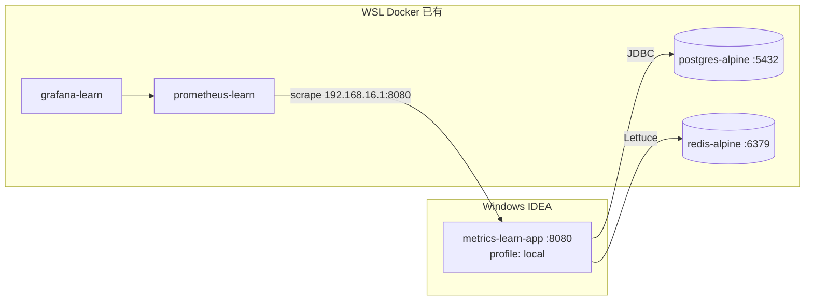

# 阶段 4：业务自定义指标 + PostgreSQL / Redis 自动指标 Implementation Plan

> **For agentic workers:** REQUIRED SUB-SKILL: Use superpowers:subagent-driven-development (recommended) or superpowers:executing-plans to implement this plan task-by-task. Steps use checkbox (`- [ ]`) syntax for tracking.

**Goal:** 在已有监控栈上扩展 `metrics-learn-app`：用 `MeterRegistry` 埋点业务订单指标；接入 WSL 中已有的 PostgreSQL 与 Redis，观察 HikariCP / Lettuce 自动指标；在 Grafana Dashboard 中新增对应 Panel，理解「手动埋点 vs 框架自动埋点」两种模式。

**Architecture:** 延续阶段 0～3 拓扑（**Windows** 跑应用，**WSL Docker** 跑 Prometheus + Grafana）。本阶段在 `metrics-learn-app` 新增 JPA 订单模块与 Redis 缓存模块；`local` profile 连接 WSL `postgres-alpine:5432`、`redis-alpine:6379`；单元测试使用 **H2 内存库** + **Mock Redis**，不依赖 WSL 中间件即可 `mvn test`；Grafana 在既有 `metrics-learn-overview.json` 上追加业务/连接池/Redis Panel。本阶段**不**做 Alertmanager、Nacos/Kafka 接入（B 阶段）。

**Tech Stack:** Java 21、Spring Boot 3.3.5、Spring Data JPA、PostgreSQL、Spring Data Redis（Lettuce）、Micrometer `MeterRegistry`、HikariCP、JUnit 5、MockMvc、Grafana Dashboard JSON

---

## 实际场景说明

### 业务故事

阶段 3 完成后，团队已能用 Grafana 查看 HTTP/JVM 指标。产品经理要求对「**下单**」业务做可观测性，并关注 **数据库连接池** 与 **Redis 缓存** 的健康与性能：

1. 每次下单成功/失败，要有业务 Counter（`app_orders_total`）
2. 查订单耗时要可统计（Timer）
3. 连接 PostgreSQL 后，HikariCP 连接池指标应自动出现
4. 使用 Redis 缓存后，Lettuce 命令耗时应自动出现
5. Grafana 上能同时看到 **业务指标 + 中间件指标**

### 本阶段新增 API

| 方法 | 路径 | 作用 | 指标来源 |
|------|------|------|----------|
| `POST` | `/api/orders` | 创建订单（写库） | `app_orders_total` Counter |
| `GET` | `/api/orders/{id}` | 查询订单（读库） | HikariCP + 可选 Timer |
| `GET` | `/api/cache/demo/{key}` | 读 Redis 缓存 | `lettuce_command_*` |
| `POST` | `/api/cache/demo` | 写 Redis 缓存 | `lettuce_command_*` |

阶段 0 商品 API（`/api/products`）**保留不变**，用于对照「纯内存服务」与「带中间件服务」的指标差异。

### 部署拓扑（与阶段 3 相同，增加中间件依赖）



### 阶段 4 结束时应达到的效果

| 维度 | 效果 |
|------|------|
| **4a 业务** | `app_orders_total{status="success\|failure"}` 在 Prometheus/Grafana 可查 |
| **4a 业务** | 至少 1 个业务 Timer（查单或下单耗时） |
| **4b PG** | `/actuator/prometheus` 有 `hikaricp_connections_*` |
| **4c Redis** | `/actuator/prometheus` 有 `lettuce_command_completion_seconds_*` |
| **Grafana** | Dashboard 新增 ≥3 个 Panel（订单、连接池、Redis） |
| **测试** | `mvn -pl metrics-learn-app test` 全部通过（H2 + Mock，无需 WSL DB） |
| **概念** | 阅读 `docs/learning/phase-4-business-and-middleware-metrics.md` 并完成 4 道自检题 |
| **范围边界** | 不做 Alertmanager、不做 Kafka/Nacos/APISIX |

### 当前仓库状态（增量起点 — 阶段 3 已完成）

| 路径 | 状态 |
|------|------|
| `metrics-learn-app` | 内存商品 API、Actuator、Prometheus 导出 |
| `application.yml` | 含 `percentiles-histogram` for `http.server.requests` |
| `application-local.yml.example` | 已有 Postgres/Redis 模板 |
| `docker/observability/` | `prometheus-learn` + `grafana-learn` |
| `pom.xml` | 尚无 JPA、PostgreSQL、Redis 依赖 |

---

## 文件结构（本阶段新增/修改）

| 文件 | 职责 |
|------|------|
| `metrics-learn-app/pom.xml` | 增加 JPA、PostgreSQL、Redis、H2（test） |
| `application-local.yml` | 本地连接 WSL 中间件（gitignore，自行创建） |
| `src/test/resources/application-test.yml` | H2 + 禁用/模拟 Redis，供 `mvn test` |
| `domain/Order.java` | 订单 JPA 实体 |
| `repository/OrderRepository.java` | 订单仓储 |
| `service/OrderService.java` | 下单/查单 + `MeterRegistry` 埋点 |
| `service/CacheDemoService.java` | Redis 读写封装 |
| `controller/OrderController.java` | 订单 REST |
| `controller/CacheDemoController.java` | 缓存 REST |
| `test/.../OrderServiceTest.java` | 业务指标单元测试 |
| `test/.../OrderControllerTest.java` | 订单 API 集成测试 |
| `test/.../CacheDemoControllerTest.java` | 缓存 API 测试（Mock Redis） |
| `grafana/dashboards/metrics-learn-overview.json` | 追加 Panel |
| `docs/learning/phase-4-business-and-middleware-metrics.md` | 概念与自检 |
| `README.md` | 阶段 4 章节 |

---

## Task 1: Maven 依赖与测试配置

**Files:**
- Modify: `metrics-learn-app/pom.xml`
- Create: `metrics-learn-app/src/test/resources/application-test.yml`

- [ ] **Step 1: 在 pom.xml 追加依赖**

```xml
        <dependency>
            <groupId>org.springframework.boot</groupId>
            <artifactId>spring-boot-starter-data-jpa</artifactId>
        </dependency>
        <dependency>
            <groupId>org.postgresql</groupId>
            <artifactId>postgresql</artifactId>
            <scope>runtime</scope>
        </dependency>
        <dependency>
            <groupId>org.springframework.boot</groupId>
            <artifactId>spring-boot-starter-data-redis</artifactId>
        </dependency>
        <dependency>
            <groupId>com.h2database</groupId>
            <artifactId>h2</artifactId>
            <scope>test</scope>
        </dependency>
```

- [ ] **Step 2: 创建 application-test.yml**

```yaml
spring:
  config:
    activate:
      on-profile: test
  datasource:
    url: jdbc:h2:mem:metrics_learn_test;MODE=PostgreSQL;DB_CLOSE_DELAY=-1
    driver-class-name: org.h2.Driver
    username: sa
    password:
  jpa:
    hibernate:
      ddl-auto: create-drop
    show-sql: false
    database-platform: org.hibernate.dialect.H2Dialect
  data:
    redis:
      host: localhost
      port: 6379

management:
  prometheus:
    metrics:
      export:
        enabled: true
```

说明：缓存测试用 `@MockBean` 模拟 Redis，避免 `mvn test` 强依赖 WSL Redis。

- [ ] **Step 3: 编译**

```bash
cd D:\Project_Install\JAVA_Develop\Operations-And-Maintenance\Grafana-Prometheus-Micrometer-Learn
mvn -pl metrics-learn-app -q compile test-compile
```

Expected: exit code `0`

- [ ] **Step 4: Commit**

```bash
git add metrics-learn-app/pom.xml metrics-learn-app/src/test/resources/application-test.yml
git commit -m "feat(phase-4): add jpa redis dependencies and test profile"
```

---

## Task 2: 本地 profile 与 WSL 中间件准备

**Files:**
- Create: `metrics-learn-app/src/main/resources/application-local.yml`（本地，gitignore）
- Modify: `metrics-learn-app/src/main/resources/application-local.yml.example`（可选补充说明）

- [ ] **Step 1: WSL 中创建数据库**

```bash
docker exec -it postgres-alpine psql -U postgres -c "CREATE DATABASE metrics_learn;"
```

若库已存在可跳过。

- [ ] **Step 2: 复制并填写 application-local.yml**

由 `application-local.yml.example` 复制为 `application-dev.yml`：

```yaml
spring:
  profiles:
    active: dev
  datasource:
    url: jdbc:postgresql://localhost:5432/metrics_learn
    username: postgres
    password: <你的密码>
    hikari:
      maximum-pool-size: 10
      pool-name: metrics-learn-pool
  jpa:
    hibernate:
      ddl-auto: update
    show-sql: false
  data:
    redis:
      host: localhost
      port: 6379
```

- [ ] **Step 3: IDEA 运行配置**

- Active profiles: **`local`**
- JDK: **21**

- [ ] **Step 4: 验证中间件连通（Windows）**

```powershell
# 需已安装 psql / redis-cli，或在 WSL 中测试
# WSL 中：
# psql -h localhost -U postgres -d metrics_learn -c "SELECT 1"
# redis-cli -h localhost ping
```

- [ ] **Step 5: Commit（仅 example，不提交 local）**

```bash
git add metrics-learn-app/src/main/resources/application-local.yml.example
git commit -m "docs(phase-4): clarify local profile for postgres and redis"
```

---

## Task 3: 订单领域模型（JPA）

**Files:**
- Create: `metrics-learn-app/src/main/java/com/metricslearn/domain/Order.java`
- Create: `metrics-learn-app/src/main/java/com/metricslearn/repository/OrderRepository.java`

- [ ] **Step 1: 创建 Order 实体**

```java
package com.metricslearn.domain;

import jakarta.persistence.Column;
import jakarta.persistence.Entity;
import jakarta.persistence.GeneratedValue;
import jakarta.persistence.GenerationType;
import jakarta.persistence.Id;
import jakarta.persistence.Table;

import java.time.Instant;

@Entity
@Table(name = "orders")
public class Order {

    @Id
    @GeneratedValue(strategy = GenerationType.IDENTITY)
    private Long id;

    @Column(nullable = false)
    private Long productId;

    @Column(nullable = false)
    private int quantity;

    @Column(nullable = false)
    private double amount;

    @Column(nullable = false)
    private Instant createdAt;

    protected Order() {
    }

    public Order(Long productId, int quantity, double amount, Instant createdAt) {
        this.productId = productId;
        this.quantity = quantity;
        this.amount = amount;
        this.createdAt = createdAt;
    }

    public Long getId() { return id; }
    public Long getProductId() { return productId; }
    public int getQuantity() { return quantity; }
    public double getAmount() { return amount; }
    public Instant getCreatedAt() { return createdAt; }
}
```

- [ ] **Step 2: 创建 OrderRepository**

```java
package com.metricslearn.repository;

import com.metricslearn.domain.Order;
import org.springframework.data.jpa.repository.JpaRepository;

public interface OrderRepository extends JpaRepository<Order, Long> {
}
```

- [ ] **Step 3: Commit**

```bash
git add metrics-learn-app/src/main/java/com/metricslearn/domain/Order.java
git add metrics-learn-app/src/main/java/com/metricslearn/repository/OrderRepository.java
git commit -m "feat(phase-4): add order entity and repository"
```

---

## Task 4: 业务指标 — OrderService（TDD）

**Files:**
- Create: `metrics-learn-app/src/main/java/com/metricslearn/service/OrderService.java`
- Test: `metrics-learn-app/src/test/java/com/metricslearn/service/OrderServiceTest.java`

**指标约定：**

| 指标名 | 类型 | 标签 |
|--------|------|------|
| `app.orders.total` | Counter | `status=success\|failure` |
| `app.orders.query` | Timer | 无高基数标签 |

Prometheus 导出名为：`app_orders_total`、`app_orders_query_seconds_*`

- [ ] **Step 1: 编写失败的 OrderServiceTest**

```java
package com.metricslearn.service;

import com.metricslearn.domain.Order;
import com.metricslearn.domain.Product;
import com.metricslearn.repository.OrderRepository;
import io.micrometer.core.instrument.Counter;
import io.micrometer.core.instrument.MeterRegistry;
import io.micrometer.core.instrument.simple.SimpleMeterRegistry;
import org.junit.jupiter.api.BeforeEach;
import org.junit.jupiter.api.Test;
import org.junit.jupiter.api.extension.ExtendWith;
import org.mockito.ArgumentCaptor;
import org.mockito.Mock;
import org.mockito.junit.jupiter.MockitoExtension;

import java.util.Optional;

import static org.assertj.core.api.Assertions.assertThat;
import static org.mockito.ArgumentMatchers.any;
import static org.mockito.Mockito.verify;
import static org.mockito.Mockito.when;

@ExtendWith(MockitoExtension.class)
class OrderServiceTest {

    @Mock
    private ProductService productService;

    @Mock
    private OrderRepository orderRepository;

    private MeterRegistry meterRegistry;
    private OrderService orderService;

    @BeforeEach
    void setUp() {
        meterRegistry = new SimpleMeterRegistry();
        orderService = new OrderService(productService, orderRepository, meterRegistry);
    }

    @Test
    void createOrderShouldIncrementSuccessCounter() {
        when(productService.findById(1L))
                .thenReturn(Optional.of(new Product(1L, "Prometheus 入门手册", 49.90)));
        when(orderRepository.save(any(Order.class)))
                .thenAnswer(inv -> {
                    Order o = inv.getArgument(0);
                    return new Order(1L, o.getProductId(), o.getQuantity(), o.getAmount(), o.getCreatedAt());
                });

        orderService.createOrder(1L, 2);

        Counter counter = meterRegistry.find("app.orders.total").tag("status", "success").counter();
        assertThat(counter).isNotNull();
        assertThat(counter.count()).isEqualTo(1.0);
    }

    @Test
    void createOrderShouldIncrementFailureCounterWhenProductMissing() {
        when(productService.findById(999L)).thenReturn(Optional.empty());

        orderService.createOrder(999L, 1);

        Counter counter = meterRegistry.find("app.orders.total").tag("status", "failure").counter();
        assertThat(counter).isNotNull();
        assertThat(counter.count()).isEqualTo(1.0);
    }
}
```

- [ ] **Step 2: 运行测试确认失败**

```bash
mvn -pl metrics-learn-app -q test -Dtest=OrderServiceTest
```

Expected: FAIL（`OrderService` 不存在）

- [ ] **Step 3: 实现 OrderService**

```java
package com.metricslearn.service;

import com.metricslearn.domain.Order;
import com.metricslearn.domain.Product;
import com.metricslearn.repository.OrderRepository;
import io.micrometer.core.instrument.MeterRegistry;
import io.micrometer.core.instrument.Timer;
import org.springframework.stereotype.Service;
import org.springframework.transaction.annotation.Transactional;

import java.time.Instant;
import java.util.Optional;

@Service
public class OrderService {

    private final ProductService productService;
    private final OrderRepository orderRepository;
    private final MeterRegistry meterRegistry;

    public OrderService(ProductService productService,
                        OrderRepository orderRepository,
                        MeterRegistry meterRegistry) {
        this.productService = productService;
        this.orderRepository = orderRepository;
        this.meterRegistry = meterRegistry;
    }

    @Transactional
    public Optional<Order> createOrder(Long productId, int quantity) {
        Optional<Product> productOpt = productService.findById(productId);
        if (productOpt.isEmpty()) {
            meterRegistry.counter("app.orders.total", "status", "failure").increment();
            return Optional.empty();
        }
        Product product = productOpt.get();
        double amount = product.price() * quantity;
        Order order = new Order(productId, quantity, amount, Instant.now());
        Order saved = orderRepository.save(order);
        meterRegistry.counter("app.orders.total", "status", "success").increment();
        return Optional.of(saved);
    }

    @Transactional(readOnly = true)
    public Optional<Order> findById(Long id) {
        return Timer.builder("app.orders.query")
                .description("Order query duration")
                .register(meterRegistry)
                .record(() -> orderRepository.findById(id));
    }
}
```

- [ ] **Step 4: 运行测试确认通过**

```bash
mvn -pl metrics-learn-app -q test -Dtest=OrderServiceTest
```

Expected: `Tests run: 2, Failures: 0`

- [ ] **Step 5: Commit**

```bash
git add metrics-learn-app/src/main/java/com/metricslearn/service/OrderService.java
git add metrics-learn-app/src/test/java/com/metricslearn/service/OrderServiceTest.java
git commit -m "feat(phase-4): add order service with business metrics"
```

---

## Task 5: 订单 REST API

**Files:**
- Create: `metrics-learn-app/src/main/java/com/metricslearn/controller/OrderController.java`
- Create: `metrics-learn-app/src/main/java/com/metricslearn/web/dto/CreateOrderRequest.java`
- Test: `metrics-learn-app/src/test/java/com/metricslearn/controller/OrderControllerTest.java`

- [ ] **Step 1: 创建 CreateOrderRequest**

```java
package com.metricslearn.web.dto;

public record CreateOrderRequest(Long productId, int quantity) {
}
```

- [ ] **Step 2: 编写失败的 OrderControllerTest**

```java
package com.metricslearn.controller;

import com.metricslearn.repository.OrderRepository;
import com.metricslearn.service.ProductService;
import org.junit.jupiter.api.Test;
import org.springframework.beans.factory.annotation.Autowired;
import org.springframework.boot.test.autoconfigure.web.servlet.AutoConfigureMockMvc;
import org.springframework.boot.test.context.SpringBootTest;
import org.springframework.http.MediaType;
import org.springframework.test.context.ActiveProfiles;
import org.springframework.test.web.servlet.MockMvc;

import static org.springframework.test.web.servlet.request.MockMvcRequestBuilders.get;
import static org.springframework.test.web.servlet.request.MockMvcRequestBuilders.post;
import static org.springframework.test.web.servlet.result.MockMvcResultMatchers.jsonPath;
import static org.springframework.test.web.servlet.result.MockMvcResultMatchers.status;

@SpringBootTest
@AutoConfigureMockMvc
@ActiveProfiles("test")
class OrderControllerTest {

    @Autowired
    private MockMvc mockMvc;

    @Test
    void createOrderShouldReturn201() throws Exception {
        mockMvc.perform(post("/api/orders")
                        .contentType(MediaType.APPLICATION_JSON)
                        .content("{\"productId\":1,\"quantity\":2}"))
                .andExpect(status().isCreated())
                .andExpect(jsonPath("$.productId").value(1))
                .andExpect(jsonPath("$.quantity").value(2));
    }

    @Test
    void createOrderShouldReturn404WhenProductMissing() throws Exception {
        mockMvc.perform(post("/api/orders")
                        .contentType(MediaType.APPLICATION_JSON)
                        .content("{\"productId\":999,\"quantity\":1}"))
                .andExpect(status().isNotFound());
    }

    @Test
    void getOrderByIdShouldReturn200() throws Exception {
        String body = mockMvc.perform(post("/api/orders")
                        .contentType(MediaType.APPLICATION_JSON)
                        .content("{\"productId\":1,\"quantity\":1}"))
                .andExpect(status().isCreated())
                .andReturn().getResponse().getContentAsString();

        Long id = com.jayway.jsonpath.JsonPath.read(body, "$.id");

        mockMvc.perform(get("/api/orders/" + id))
                .andExpect(status().isOk())
                .andExpect(jsonPath("$.id").value(id.intValue()));
    }
}
```

需在 `pom.xml` test 范围确认已有 `spring-boot-starter-test`（含 json-path）。

- [ ] **Step 3: 实现 OrderController**

```java
package com.metricslearn.controller;

import com.metricslearn.domain.Order;
import com.metricslearn.service.OrderService;
import com.metricslearn.web.dto.CreateOrderRequest;
import org.springframework.http.HttpStatus;
import org.springframework.http.ResponseEntity;
import org.springframework.web.bind.annotation.GetMapping;
import org.springframework.web.bind.annotation.PathVariable;
import org.springframework.web.bind.annotation.PostMapping;
import org.springframework.web.bind.annotation.RequestBody;
import org.springframework.web.bind.annotation.RequestMapping;
import org.springframework.web.bind.annotation.RestController;

@RestController
@RequestMapping("/api/orders")
public class OrderController {

    private final OrderService orderService;

    public OrderController(OrderService orderService) {
        this.orderService = orderService;
    }

    @PostMapping
    public ResponseEntity<Order> createOrder(@RequestBody CreateOrderRequest request) {
        return orderService.createOrder(request.productId(), request.quantity())
                .map(order -> ResponseEntity.status(HttpStatus.CREATED).body(order))
                .orElse(ResponseEntity.notFound().build());
    }

    @GetMapping("/{id}")
    public ResponseEntity<Order> getOrder(@PathVariable Long id) {
        return orderService.findById(id)
                .map(ResponseEntity::ok)
                .orElse(ResponseEntity.notFound().build());
    }
}
```

- [ ] **Step 4: 运行测试**

```bash
mvn -pl metrics-learn-app -q test -Dtest=OrderControllerTest
```

Expected: 3 tests pass

- [ ] **Step 5: Commit**

```bash
git add metrics-learn-app/src/main/java/com/metricslearn/controller/OrderController.java
git add metrics-learn-app/src/main/java/com/metricslearn/web/dto/CreateOrderRequest.java
git add metrics-learn-app/src/test/java/com/metricslearn/controller/OrderControllerTest.java
git commit -m "feat(phase-4): add order REST API with tests"
```

---

## Task 6: Redis 缓存 API

**Files:**
- Create: `metrics-learn-app/src/main/java/com/metricslearn/service/CacheDemoService.java`
- Create: `metrics-learn-app/src/main/java/com/metricslearn/controller/CacheDemoController.java`
- Create: `metrics-learn-app/src/main/java/com/metricslearn/web/dto/CacheWriteRequest.java`
- Test: `metrics-learn-app/src/test/java/com/metricslearn/controller/CacheDemoControllerTest.java`

- [ ] **Step 1: 创建 CacheWriteRequest**

```java
package com.metricslearn.web.dto;

public record CacheWriteRequest(String key, String value) {
}
```

- [ ] **Step 2: 编写 CacheDemoControllerTest（Mock Redis）**

```java
package com.metricslearn.controller;

import com.metricslearn.service.CacheDemoService;
import org.junit.jupiter.api.Test;
import org.springframework.beans.factory.annotation.Autowired;
import org.springframework.boot.test.autoconfigure.web.servlet.AutoConfigureMockMvc;
import org.springframework.boot.test.context.SpringBootTest;
import org.springframework.boot.test.mock.mockito.MockBean;
import org.springframework.http.MediaType;
import org.springframework.test.context.ActiveProfiles;
import org.springframework.test.web.servlet.MockMvc;

import java.util.Optional;

import static org.mockito.ArgumentMatchers.eq;
import static org.mockito.Mockito.verify;
import static org.mockito.Mockito.when;
import static org.springframework.test.web.servlet.request.MockMvcRequestBuilders.get;
import static org.springframework.test.web.servlet.request.MockMvcRequestBuilders.post;
import static org.springframework.test.web.servlet.result.MockMvcResultMatchers.jsonPath;
import static org.springframework.test.web.servlet.result.MockMvcResultMatchers.status;

@SpringBootTest
@AutoConfigureMockMvc
@ActiveProfiles("test")
class CacheDemoControllerTest {

    @Autowired
    private MockMvc mockMvc;

    @MockBean
    private CacheDemoService cacheDemoService;

    @Test
    void getCacheShouldReturn200WhenFound() throws Exception {
        when(cacheDemoService.get("k1")).thenReturn(Optional.of("v1"));

        mockMvc.perform(get("/api/cache/demo/k1"))
                .andExpect(status().isOk())
                .andExpect(jsonPath("$.key").value("k1"))
                .andExpect(jsonPath("$.value").value("v1"));
    }

    @Test
    void putCacheShouldReturn204() throws Exception {
        mockMvc.perform(post("/api/cache/demo")
                        .contentType(MediaType.APPLICATION_JSON)
                        .content("{\"key\":\"k2\",\"value\":\"v2\"}"))
                .andExpect(status().isNoContent());

        verify(cacheDemoService).put("k2", "v2");
    }
}
```

- [ ] **Step 3: 实现 CacheDemoService**

```java
package com.metricslearn.service;

import org.springframework.data.redis.core.StringRedisTemplate;
import org.springframework.stereotype.Service;

import java.time.Duration;
import java.util.Optional;

@Service
public class CacheDemoService {

    private static final Duration TTL = Duration.ofMinutes(10);

    private final StringRedisTemplate redisTemplate;

    public CacheDemoService(StringRedisTemplate redisTemplate) {
        this.redisTemplate = redisTemplate;
    }

    public Optional<String> get(String key) {
        return Optional.ofNullable(redisTemplate.opsForValue().get(key));
    }

    public void put(String key, String value) {
        redisTemplate.opsForValue().set(key, value, TTL);
    }
}
```

- [ ] **Step 4: 实现 CacheDemoController**

```java
package com.metricslearn.controller;

import com.metricslearn.service.CacheDemoService;
import com.metricslearn.web.dto.CacheWriteRequest;
import org.springframework.http.ResponseEntity;
import org.springframework.web.bind.annotation.GetMapping;
import org.springframework.web.bind.annotation.PathVariable;
import org.springframework.web.bind.annotation.PostMapping;
import org.springframework.web.bind.annotation.RequestBody;
import org.springframework.web.bind.annotation.RequestMapping;
import org.springframework.web.bind.annotation.RestController;

import java.util.Map;

@RestController
@RequestMapping("/api/cache/demo")
public class CacheDemoController {

    private final CacheDemoService cacheDemoService;

    public CacheDemoController(CacheDemoService cacheDemoService) {
        this.cacheDemoService = cacheDemoService;
    }

    @GetMapping("/{key}")
    public ResponseEntity<Map<String, String>> get(@PathVariable String key) {
        return cacheDemoService.get(key)
                .map(value -> ResponseEntity.ok(Map.of("key", key, "value", value)))
                .orElse(ResponseEntity.notFound().build());
    }

    @PostMapping
    public ResponseEntity<Void> put(@RequestBody CacheWriteRequest request) {
        cacheDemoService.put(request.key(), request.value());
        return ResponseEntity.noContent().build();
    }
}
```

- [ ] **Step 5: 运行测试**

```bash
mvn -pl metrics-learn-app -q test -Dtest=CacheDemoControllerTest
```

- [ ] **Step 6: 运行全部测试**

```bash
mvn -pl metrics-learn-app test
```

Expected: 全部通过

- [ ] **Step 7: Commit**

```bash
git add metrics-learn-app/src/main/java/com/metricslearn/service/CacheDemoService.java
git add metrics-learn-app/src/main/java/com/metricslearn/controller/CacheDemoController.java
git add metrics-learn-app/src/main/java/com/metricslearn/web/dto/CacheWriteRequest.java
git add metrics-learn-app/src/test/java/com/metricslearn/controller/CacheDemoControllerTest.java
git commit -m "feat(phase-4): add redis cache demo API"
```

---

## Task 7: 本地验证中间件自动指标

**Files:** 无（手动 + 可选 Actuator 测试）

- [ ] **Step 1: 使用 `local` profile 启动应用（Windows IDEA）**

- [ ] **Step 2: 产生 DB 与 Redis 流量**

```powershell
curl -X POST http://localhost:8080/api/orders -H "Content-Type: application/json" -d "{\"productId\":1,\"quantity\":2}"
curl http://localhost:8080/api/orders/1
curl -X POST http://localhost:8080/api/cache/demo -H "Content-Type: application/json" -d "{\"key\":\"demo\",\"value\":\"hello\"}"
curl http://localhost:8080/api/cache/demo/demo
```

- [ ] **Step 3: 在 `/actuator/prometheus` 中确认指标**

```powershell
curl -s http://localhost:8080/actuator/prometheus | findstr /C:"app_orders_total" /C:"hikaricp_connections" /C:"lettuce_command"
```

Expected: 三类指标均有输出

| 类型 | 示例指标 |
|------|----------|
| 业务 Counter | `app_orders_total{status="success",...}` |
| HikariCP | `hikaricp_connections_active{pool="metrics-learn-pool",...}` |
| Lettuce | `lettuce_command_completion_seconds_count{...}` |

- [ ] **Step 4: Prometheus / Grafana 验证**

Prometheus：

```promql
app_orders_total{application="metrics-learn"}
hikaricp_connections_active{application="metrics-learn"}
rate(lettuce_command_completion_seconds_count{application="metrics-learn"}[1m])
```

- [ ] **Step 5（可选强化）: 故意配错 Redis 密码**

观察 `/actuator/health` 中 `redis` 为 DOWN，但 Prometheus Target 仍 UP——理解 **进程存活 ≠ 依赖健康**。

---

## Task 8: Grafana Dashboard 扩展

**Files:**
- Modify: `docker/observability/grafana/dashboards/metrics-learn-overview.json`

在现有 4 个 Panel 下方追加 3 个 Panel（`gridPos.y` 从 16 起）：

| Panel | PromQL |
|-------|--------|
| 订单成功速率 | `sum(rate(app_orders_total{application="metrics-learn",status="success"}[1m]))` |
| HikariCP 活跃连接 | `hikaricp_connections_active{application="metrics-learn"}` |
| Redis 命令速率 | `sum(rate(lettuce_command_completion_seconds_count{application="metrics-learn"}[1m]))` |

- [ ] **Step 1: 编辑 JSON，追加 Panel id 5、6、7**

示例 Panel（订单成功速率）：

```json
{
  "id": 5,
  "title": "Order Success Rate",
  "type": "timeseries",
  "gridPos": { "h": 8, "w": 8, "x": 0, "y": 16 },
  "datasource": { "type": "prometheus", "uid": "prometheus" },
  "targets": [
    {
      "refId": "A",
      "expr": "sum(rate(app_orders_total{application=\"metrics-learn\",status=\"success\"}[1m]))",
      "legendFormat": "orders/s"
    }
  ],
  "fieldConfig": { "defaults": { "unit": "ops" }, "overrides": [] }
}
```

按同样方式为 HikariCP、Redis 添加 id 6、7（`gridPos.x` 分别为 8、16）。

- [ ] **Step 2: 重启 Grafana 或等待 provisioning 刷新**

```bash
docker compose restart grafana-learn
```

- [ ] **Step 3: 产生流量后确认曲线**

- [ ] **Step 4: Commit**

```bash
git add docker/observability/grafana/dashboards/metrics-learn-overview.json
git commit -m "feat(phase-4): add business db redis panels to grafana dashboard"
```

---

## Task 9: 概念学习文档

**Files:**
- Create: `docs/learning/phase-4-business-and-middleware-metrics.md`

- [ ] **Step 1: 创建文档（完整内容）**

```markdown
# 阶段 4：业务指标与中间件自动指标

## 1. 两种埋点模式

| 模式 | 谁注册指标 | 本阶段示例 |
|------|-----------|-----------|
| 手动埋点 | 业务代码 `MeterRegistry` | `app.orders.total` |
| 自动埋点 | 框架/连接池/客户端 | `hikaricp_connections_*`、`lettuce_command_*` |

## 2. 业务指标 API

| API | 用途 | 注意 |
|-----|------|------|
| `Counter` | 只增计数 | 适合订单数、失败次数 |
| `Timer` | 耗时分布 | 适合查单耗时 |
| `Gauge` | 可升可降 | 适合队列长度（本阶段未用） |

**标签原则：** 用 `status=success|failure`；**禁止** `orderId` 等高基数标签。

## 3. HikariCP vs Lettuce

| 中间件 | 关注点 | 典型指标 |
|--------|--------|----------|
| PostgreSQL 连接池 | 池子是否够用 | `hikaricp_connections_active/idle/pending` |
| Redis 客户端 | 命令延迟与吞吐 | `lettuce_command_completion_seconds_*` |

## 4. 健康检查 vs 指标

- `/actuator/health`：此刻是否可用（redis DOWN）
- Metrics：趋势与容量（连接数、QPS）
- Prometheus Target UP：只表示能 scrape 到应用进程

## 5. 自检题

1. 为什么业务 Counter 放在 Service 而不是 Controller？
2. `app.orders.total` 与 `http_server_requests_seconds_count` 有何区别？
3. 何时用 HikariCP 指标，何时用 Lettuce 指标？
4. 为什么不要用 `orderId` 作为 Prometheus 标签？

## 6. 参考答案

1. Service 承载业务语义，Controller 薄；避免重复埋点。
2. 前者是业务语义；后者是 HTTP 层自动埋点，维度不同可互补。
3. JDBC 看连接池；Redis 看命令耗时——资源类型不同。
4. 高基数导致时间序列爆炸，Prometheus 内存飙升。

## 7. 下一阶段

阶段 5：巩固五种模式地图，准备 B 阶段（Nacos、Kafka、APISIX）。
```

- [ ] **Step 2: Commit**

```bash
git add docs/learning/phase-4-business-and-middleware-metrics.md
git commit -m "docs(phase-4): add business and middleware metrics concepts"
```

---

## Task 10: README 更新

**Files:**
- Modify: `README.md`

- [ ] **Step 1: 更新学习进度表，追加阶段 4 章节**

包含：

- `local` profile 与 WSL Postgres/Redis 前置
- 新增 API 列表
- 关键 PromQL（`app_orders_total`、`hikaricp_connections_active`、`lettuce_command_*`）
- 验收 checklist

- [ ] **Step 2: Commit**

```bash
git add README.md
git commit -m "docs(phase-4): update README for business and middleware metrics"
```

---

## Task 11: 手动验收（端到端）

- [ ] **Step 1: 全栈启动**

| 顺序 | 操作 |
|------|------|
| 1 | WSL Postgres、Redis 运行中 |
| 2 | Windows IDEA，`local` profile 启动应用 |
| 3 | WSL `docker compose up -d` |
| 4 | Prometheus Targets UP |

- [ ] **Step 2: 业务 + 中间件流量**

```powershell
1..10 | ForEach-Object {
  curl -s -X POST http://localhost:8080/api/orders -H "Content-Type: application/json" -d "{\"productId\":1,\"quantity\":1}" | Out-Null
  curl -s http://localhost:8080/api/cache/demo/demo$_ | Out-Null
}
```

- [ ] **Step 3: Grafana 确认 7 个 Panel 有数据**

- [ ] **Step 4: 完成概念文档 4 道自检题**

- [ ] **Step 5: README 阶段 4 Checklist 打勾**

---

## Spec 覆盖自检

| 设计文档阶段 4 要求 | 对应 Task |
|--------------------|-----------|
| Counter `app_orders_total` | Task 4 |
| Timer / `@Timed` | Task 4 `app.orders.query` |
| Grafana 业务指标 | Task 8 |
| JPA + PostgreSQL | Task 2、3、5 |
| HikariCP 指标 | Task 7 |
| Redis + Lettuce 指标 | Task 6、7 |
| 低基数标签原则 | Task 4、9 |
| 示例四个 API | Task 5、6 |
| 复用 WSL Postgres/Redis | Task 2 |

**范围外：** Alertmanager、Exporter 旁路、Nacos/Kafka。

**占位符扫描：** 无 TBD / TODO。

---

## 预估耗时

| Task | 时间 |
|------|------|
| Task 1～2 依赖与本地配置 | 30～45 分钟 |
| Task 3～5 订单 + 业务指标 | 1.5～2 小时 |
| Task 6 Redis API | 45～60 分钟 |
| Task 7 中间件指标验证 | 30 分钟 |
| Task 8 Grafana Panel | 30～45 分钟 |
| Task 9～11 文档与验收 | 45～60 分钟 |
| **合计** | **约 5～7 小时**（可分 2 天） |

---

*Plan version: 1.0 · 2026-06-27 · 前置：阶段 3 已完成*
