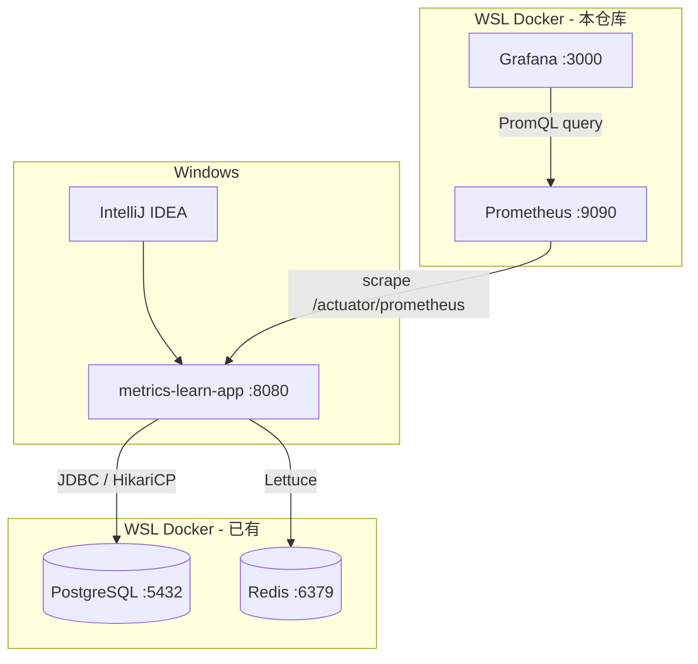

# Grafana · Prometheus · Micrometer 学习项目设计

**日期：** 2026-06-26  
**状态：** 已评审待实现  
**目标阶段：** A（基础掌握）→ 后续 B（多组件实战）

---

## 1. 背景与目标

### 1.1 学习目标

在 **Java 21 + Spring Boot 3.x** 项目中，由浅入深掌握可观测性三件套：

| 组件 | 角色 |
|------|------|
| **Micrometer** | 应用内指标采集门面（埋点 API + 自动埋点） |
| **Prometheus** | 时序数据库，Pull 模式采集并存储指标 |
| **Grafana** | 可视化与查询展示（基于 PromQL） |

**A 阶段成功标准：** 能独立为 Spring Boot 应用接入指标采集、配置 Prometheus 拉取、在 Grafana 中查看 HTTP/JVM/连接池/Redis/自定义业务指标，并理解常用概念与项目中的常见模式。

**B 阶段（后续）：** 接入 APISIX、Kafka、Nacos 等现有 home-iot 基础设施，学习 Exporter、服务发现、网关指标等进阶模式。本设计不包含 B 阶段实现细节，仅保留衔接点。

### 1.2 环境与约束

| 项 | 选择 |
|----|------|
| 开发 | Windows + IntelliJ IDEA |
| 应用运行时 | Windows 本机（IDEA 启动 Spring Boot） |
| 监控组件部署 | WSL Docker Compose |
| Java | 21 |
| Spring Boot | 3.3.x（或当前 3.x 最新稳定版） |
| 构建工具 | Maven |
| 应用端口 | 8080 |

### 1.3 现有 Docker 资源复用策略

**A 阶段复用（WSL 已运行）：**

| 容器 | 端口 | 用途 |
|------|------|------|
| `postgres-alpine` | 5432 | 阶段 4 JPA / HikariCP 自动指标 |
| `redis-alpine` | 6379 | 阶段 4 Lettuce 自动指标 |

**A 阶段新建（本仓库 `docker/observability/`）：**

| 服务 | 端口 | 说明 |
|------|------|------|
| Prometheus | 9090 | 采集 Spring Boot `/actuator/prometheus` |
| Grafana | 3000 | 可视化 |

**A 阶段不接入：** APISIX、Keycloak、Nacos、Kafka、MySQL、MongoDB 等，避免干扰基础学习路径。

---

## 2. 学习组织方式

采用 **单一渐进式 Demo 项目**（`metrics-learn-app`）：一个 Spring Boot 应用随学习阶段逐步增加能力，形成端到端的连贯故事。相比分 Lab 多项目，更贴近真实项目演进，且便于 B 阶段在同一仓库扩展。

---

## 3. 架构与数据流



### 3.1 网络连接

| 从 | 到 | 地址 |
|----|-----|------|
| Spring Boot（Windows） | PostgreSQL | `jdbc:postgresql://localhost:5432/metrics_learn` |
| Spring Boot（Windows） | Redis | `localhost:6379` |
| Prometheus（WSL 容器） | Spring Boot | `host.docker.internal:8080` |
| Grafana（WSL 容器） | Prometheus | `http://prometheus:9090`（Compose 内网） |
| 浏览器（Windows） | Prometheus / Grafana | `http://localhost:9090` / `http://localhost:3000` |

**备选：** 若 `host.docker.internal` 不可用，改用 Windows 主机局域网 IP，或在 `docker-compose.yml` 中配置 `extra_hosts`。

### 3.2 指标链路

```
业务代码 / 框架自动埋点
    → Micrometer MeterRegistry
    → /actuator/prometheus（Prometheus 文本格式）
    → Prometheus TSDB（定期 scrape）
    → Grafana Panel（PromQL 查询）
```

---

## 4. 仓库结构

```text
Grafana-Prometheus-Micrometer-Learn/
├── docs/
│   ├── superpowers/
│   │   └── specs/
│   │       └── 2026-06-26-grafana-prometheus-micrometer-learning-design.md
│   └── learning/                         # 可选：个人学习笔记
├── docker/
│   └── observability/
│       ├── docker-compose.yml            # Prometheus + Grafana
│       ├── prometheus/
│       │   └── prometheus.yml
│       └── grafana/
│           └── provisioning/             # 可选：数据源自动配置
├── metrics-learn-app/
│   ├── pom.xml
│   └── src/main/
│       ├── java/com/example/metricslearn/
│       │   ├── MetricsLearnApplication.java
│       │   ├── config/
│       │   ├── domain/
│       │   ├── repository/
│       │   ├── service/                  # 业务 + MeterRegistry 埋点
│       │   ├── web/
│       │   └── metrics/                  # 可选：MeterBinder 集中注册
│       └── resources/
│           ├── application.yml
│           └── application-local.yml
└── README.md                             # 总索引 + 阶段导航 + 验收 checklist
```

---

## 5. 学习路线图（由浅入深）

预估总时长：**4～6 天**（每天 2～3 小时业余学习）。

### 阶段 0：环境与概念预热（约 0.5 天）

**概念**

| 概念 | 说明 |
|------|------|
| 可观测性三支柱 | Metrics / Logs / Traces；本计划主攻 Metrics |
| Pull vs Push | Prometheus 主动拉取；Micrometer 在应用内暴露 HTTP 端点 |
| 指标类型 | Counter（只增）、Gauge（可升降）、Timer/Histogram（耗时分布）、DistributionSummary |
| 标签 Labels | 指标维度；**基数 cardinality** 过高会导致 Prometheus 内存暴涨 |

**动手**

- 初始化 Git 仓库与 Maven 项目骨架
- 引入 `spring-boot-starter-actuator`
- 访问 `/actuator/health`、`/actuator/metrics`

**验收**

- [ ] Java 21 + Spring Boot 3.x 项目能在 IDEA 启动
- [ ] 能访问 `/actuator/health`、`/actuator/metrics`
- [ ] 能说明 Counter / Gauge / Timer 的适用场景
- [ ] 能说明 Pull 与 Push 的区别

---

### 阶段 1：Micrometer + Prometheus 端点（约 1 天）

**概念与特性**

| 特性 | 说明 |
|------|------|
| Micrometer | 指标门面；Spring Boot Actuator Metrics 基于它 |
| `micrometer-registry-prometheus` | 导出 Prometheus 文本格式 |
| 自动埋点 | `http.server.requests`、JVM、Tomcat 等 |
| 配置 | `management.endpoints.web.exposure.include`、`management.metrics.tags` |

**常见模式**

- **Actuator 作为指标出口：** `/actuator/prometheus` 是 Spring Boot 项目标配
- **统一公共标签：** `application`、`environment` 便于 Grafana 筛选

**动手**

- 添加 `micrometer-registry-prometheus`
- 查看 `/actuator/prometheus` 原始输出
- 理解 `# HELP`、`# TYPE` 与 `metric{label="value"} number` 格式

**验收**

- [ ] `/actuator/prometheus` 可访问，可见 `jvm_*`、`http_server_requests_*`
- [ ] 配置 `management.metrics.tags.application=metrics-learn`
- [ ] 能读懂一行样本指标及其标签

---

### 阶段 2：Prometheus 采集（约 1 天）

**概念与特性**

| 概念 | 说明 |
|------|------|
| `scrape_configs` | job、targets、scrape_interval |
| Target UP/DOWN | 采集目标是否可达 |
| 时序模型 | metric name + labels + timestamp + value |
| PromQL 入门 | `up`、`{job="..."}`、标签选择器 |

**常见模式**

- **静态 Pull 采集：** `prometheus.yml` 中配置固定 target 列表（A 阶段主路径）

**动手**

- `docker compose up` 启动 Prometheus
- 配置 scrape 指向 `host.docker.internal:8080`
- Prometheus UI → Status → Targets 显示 UP

**验收**

- [ ] Prometheus 容器正常运行（9090）
- [ ] Target job `metrics-learn` 状态为 UP
- [ ] `up{job="metrics-learn"}` 返回 1
- [ ] 能查到 `http_server_requests_seconds_count`

---

### 阶段 3：Grafana 可视化（约 1 天）

**概念与特性**

| 概念 | 说明 |
|------|------|
| Data Source | Grafana 连接 Prometheus |
| Dashboard / Panel | 图表、查询、时间范围 |
| 社区 Dashboard | JVM (Micrometer) 等模板，理解结构即可 |
| PromQL 函数 | `rate()`、`sum by ()`、`histogram_quantile()` |

**动手**

- Grafana 添加 Prometheus 数据源
- 导入或自建面板：HTTP QPS、P95 延迟、JVM 堆内存、GC
- 压测或反复调用接口，观察曲线变化

**验收**

- [ ] Grafana 数据源连接成功
- [ ] 至少 4 个 Panel：HTTP 请求速率、P95 延迟、JVM 堆内存、GC
- [ ] 会使用 `rate(http_server_requests_seconds_count[1m])`
- [ ] 接口调用后曲线有明显变化

---

### 阶段 4：自定义业务指标 + Redis / PostgreSQL 自动指标（约 1～2 天）

#### 4a — 业务自定义指标

**概念与 API**

| API / 注解 | 用途 |
|------------|------|
| `MeterRegistry.counter(...)` | 订单数、失败次数等单调递增 |
| `MeterRegistry.gauge(...)` | 队列长度、缓存大小等可升可降 |
| `Timer` / `@Timed` | 业务方法耗时 |
| 命名规范 | 小写点分；避免高基数 tag（如 `userId`、`orderId`） |

**常见模式**

- 在 **Service 层** 埋点，而非 Controller 散落各处
- **低基数标签：** `status=success|failure`，不用唯一 ID 作标签

**验收**

- [ ] 至少 1 个 Counter（如 `app_orders_total`，标签 `status`）
- [ ] 至少 1 个 Timer 或 `@Timed`
- [ ] Grafana 能查询到业务指标
- [ ] 能解释为何不用 `orderId` 作标签

#### 4b — PostgreSQL / HikariCP 自动指标

**依赖：** `spring-boot-starter-data-jpa` + `postgresql` 驱动

**自动指标示例**

- `hikaricp_connections_active`
- `hikaricp_connections_idle`
- `hikaricp_connections_pending`
- `hikaricp_connections_max`

**动手**

- `application-local.yml` 连接 WSL Postgres（库名 `metrics_learn`）
- 实体 + Repository + 访问 DB 的 REST 接口
- Grafana Panel：活跃/空闲连接数

**验收**

- [ ] `/actuator/prometheus` 可见 HikariCP 指标
- [ ] 调用 DB 接口后 `hikaricp_connections_active` 有变化
- [ ] Grafana 能展示连接池 Panel

#### 4c — Redis / Lettuce 自动指标

**依赖：** `spring-boot-starter-data-redis`（默认 Lettuce 客户端）

**自动指标示例**

- `lettuce_command_completion_seconds_*`（命令耗时直方图）
- 连接相关指标（视 pool 配置而定）

**动手**

- `application-local.yml` 连接 WSL Redis
- 读写缓存的 REST 接口
- Grafana Panel：Redis 命令速率或 P95 延迟

**验收**

- [ ] `/actuator/prometheus` 可见 Lettuce 相关指标
- [ ] 调用 Redis 接口后指标有变化
- [ ] Grafana 能展示 Redis Panel
- [ ] 能对比：JDBC 看连接池，Redis 看命令耗时——两种中间件监控形态

**强化练习**

1. 连续调用 DB 接口 → 观察 `hikaricp_connections_active`
2. 连续调用 Redis 接口 → 观察 `lettuce_command_*`
3. 故意配错 Redis 密码 → Target 仍 UP，但 `/actuator/health` 中 redis 为 DOWN；理解「进程存活 ≠ 依赖健康」

#### 阶段 4 示例接口

| 接口 | 作用 | 指标来源 |
|------|------|----------|
| `GET /api/orders/{id}` | 查库 | HikariCP + 可选业务 Timer |
| `POST /api/orders` | 写库 | `app_orders_total` Counter |
| `GET /api/cache/demo/{key}` | 读 Redis | Lettuce 命令耗时 |
| `POST /api/cache/demo` | 写 Redis | Lettuce 命令耗时 |

---

### 阶段 5：巩固与模式地图（约 0.5 天）

**五种常用模式（A 阶段覆盖情况）**

| # | 模式 | A 阶段 |
|---|------|--------|
| 1 | Actuator Prometheus 端点 | ✅ |
| 2 | 框架自动埋点（HTTP、JVM） | ✅ |
| 3 | 连接池 / 中间件自动埋点（HikariCP、Lettuce） | ✅ 阶段 4 |
| 4 | 业务手动埋点（Counter / Timer） | ✅ 阶段 4 |
| 5 | 静态 scrape 配置 | ✅ |
| 6 | 服务发现 / Exporter 旁路采集 | ⏳ B 阶段 |

**验收**

- [ ] 能复述完整链路：代码 → Micrometer → `/actuator/prometheus` → Prometheus → Grafana
- [ ] 整理个人概念速查表
- [ ] 列出 B 阶段待学项

---

## 6. Maven 依赖

### 6.1 阶段 0～1

```xml
<parent>
    <groupId>org.springframework.boot</groupId>
    <artifactId>spring-boot-starter-parent</artifactId>
    <version>3.3.x</version>
</parent>

<dependencies>
    <dependency>
        <groupId>org.springframework.boot</groupId>
        <artifactId>spring-boot-starter-web</artifactId>
    </dependency>
    <dependency>
        <groupId>org.springframework.boot</groupId>
        <artifactId>spring-boot-starter-actuator</artifactId>
    </dependency>
    <dependency>
        <groupId>io.micrometer</groupId>
        <artifactId>micrometer-registry-prometheus</artifactId>
    </dependency>
    <dependency>
        <groupId>org.springframework.boot</groupId>
        <artifactId>spring-boot-starter-test</artifactId>
        <scope>test</scope>
    </dependency>
</dependencies>
```

### 6.2 阶段 4 追加

```xml
<dependency>
    <groupId>org.springframework.boot</groupId>
    <artifactId>spring-boot-starter-data-jpa</artifactId>
</dependency>
<dependency>
    <groupId>org.postgresql</groupId>
    <artifactId>postgresql</artifactId>
    <scope>runtime</scope>
</dependency>
<dependency>
    <groupId>org.springframework.boot</groupId>
    <artifactId>spring-boot-starter-data-redis</artifactId>
</dependency>
```

### 6.3 A 阶段不引入

- Micrometer Tracing / OpenTelemetry
- Alertmanager
- Pushgateway
- mysql-exporter、kafka-exporter 等独立 Exporter 镜像

---

## 7. 配置参考

### 7.1 `application.yml`

```yaml
spring:
  application:
    name: metrics-learn

server:
  port: 8080

management:
  endpoints:
    web:
      exposure:
        include: health,info,metrics,prometheus
  endpoint:
    health:
      show-details: when_authorized
    prometheus:
      enabled: true
  metrics:
    tags:
      application: ${spring.application.name}
```

学习期可将 `show-details` 改为 `always` 便于观察 db/redis 健康状态。

### 7.2 `application-local.yml`

```yaml
spring:
  config:
    activate:
      on-profile: local
  datasource:
    url: jdbc:postgresql://localhost:5432/metrics_learn
    username: ${POSTGRES_USER:postgres}
    password: ${POSTGRES_PASSWORD:postgres}
    hikari:
      maximum-pool-size: 10
  jpa:
    hibernate:
      ddl-auto: update
    show-sql: false
  data:
    redis:
      host: localhost
      port: 6379
```

IDEA 运行配置：**Active profiles = `local`**，JDK 21。

首次使用前在 WSL Postgres 中执行：`CREATE DATABASE metrics_learn;`

### 7.3 `prometheus.yml`

```yaml
global:
  scrape_interval: 15s
  evaluation_interval: 15s

scrape_configs:
  - job_name: metrics-learn
    metrics_path: /actuator/prometheus
    static_configs:
      - targets:
          - host.docker.internal:8080
        labels:
          env: local
```

### 7.4 Grafana 数据源（provisioning 可选）

- Type: Prometheus
- URL: `http://prometheus:9090`
- Access: Server (proxy)

---

## 8. PromQL 速查

| 场景 | PromQL |
|------|--------|
| Target 存活 | `up{job="metrics-learn"}` |
| HTTP QPS | `rate(http_server_requests_seconds_count{application="metrics-learn"}[1m])` |
| HTTP P95 | `histogram_quantile(0.95, rate(http_server_requests_seconds_bucket[5m]))` |
| JVM 堆使用 | `jvm_memory_used_bytes{area="heap"}` |
| DB 活跃连接 | `hikaricp_connections_active{application="metrics-learn"}` |
| Redis 命令 P95 | `histogram_quantile(0.95, rate(lettuce_command_completion_seconds_bucket[5m]))` |
| 业务订单成功速率 | `rate(app_orders_total{status="success"}[1m])` |

---

## 9. 排错指南

| 现象 | 可能原因 | 处理 |
|------|----------|------|
| Prometheus Target DOWN | 应用未启动或地址错误 | Windows 上 `curl http://localhost:8080/actuator/prometheus` |
| `host.docker.internal` 不通 | WSL/Windows 网络差异 | 改用 Windows 局域网 IP 或 `extra_hosts` |
| Grafana 无数据 | 数据源或时间范围 | 先在 Prometheus UI 验证；Grafana 选 Last 15 minutes |
| 无 `hikaricp_*` | 未配 DataSource 或未访问 DB | 确认 `local` profile；调用 DB 接口 |
| 无 `lettuce_*` | 未配 Redis 或未调用 | 确认 Redis 连接；调用缓存接口 |
| `/actuator/prometheus` 404 | 端点未暴露 | 检查 `management.endpoints.web.exposure.include` |
| Postgres 连接失败 | 库或账号错误 | `CREATE DATABASE metrics_learn;` 并核对账号 |
| 9090/3000 端口冲突 | 其他服务占用 | `docker ps` 检查并调整 compose 端口映射 |

---

## 10. B 阶段衔接（不在本设计范围内）

| 扩展项 | 新模式 | 现有环境 |
|--------|--------|----------|
| Nacos 服务发现 | Prometheus HTTP SD / relabel | `nacos-standalone:8848` |
| Kafka 监控 | Exporter 旁路采集 | `kafka-learn:9092` + kafka-exporter |
| APISIX 网关 | 网关 `/apisix/prometheus/metrics` | `apisix-home-iot` |
| MySQL / Mongo | 社区 exporter | 现有容器 |
| Alertmanager | 告警规则 + 通知 | 新建 compose 服务 |
| 多实例 | 同 job 多 target | 本地不同端口起两个实例 |

B 阶段在现有 Prometheus/Grafana 上增加 scrape job 与 Dashboard 即可，无需重做 A 阶段内容。

---

## 11. A 阶段交付物

| 交付物 | 说明 |
|--------|------|
| `metrics-learn-app/` | 可运行 Spring Boot 3.x + Java 21 项目 |
| `docker/observability/` | Prometheus + Grafana Compose |
| `README.md` | 阶段导航、启动顺序、验收 checklist |
| `docs/learning/` | 可选个人笔记 |
| 本设计文档 | 学习与实现的权威参考 |

---

## 12. 实现顺序建议

1. 初始化仓库与 Maven 项目（阶段 0）
2. 配置 Actuator + Prometheus registry（阶段 1）
3. 编写 `docker/observability` 并验证 Target UP（阶段 2）
4. 配置 Grafana 与基础 Dashboard（阶段 3）
5. 添加 JPA、Redis、业务埋点与对应 Panel（阶段 4）
6. 完善 README 与阶段 5 巩固清单

---

*文档版本：1.0 · 2026-06-26*
